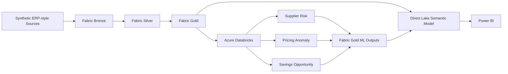
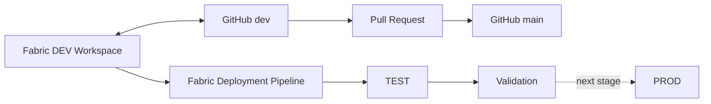

# Enterprise Procurement Intelligence Platform

An end-to-end **procurement analytics engineering portfolio** built with **Microsoft Fabric, Azure Databricks, PySpark, Delta Lake, MLflow, Direct Lake, Power BI, and GitHub**.

The platform demonstrates how ERP-style procurement data can be transformed into governed analytical products, enriched with machine learning and prescriptive analytics, and delivered through a decision-ready semantic model and Power BI reporting layer.

> **Portfolio note:** This project uses synthetic data. Financial values, supplier outcomes, ML predictions, anomalies, and savings opportunities are simulated for demonstration purposes and are not realized business results.

---

## Project at a Glance

```text
Synthetic ERP-style data
        ↓
Microsoft Fabric Bronze
        ↓
Microsoft Fabric Silver
        ↓
Microsoft Fabric Gold
        ↓
Azure Databricks ML & Prescriptive Analytics
        ↓
Fabric Gold ML Outputs
        ↓
Direct Lake Semantic Model
        ↓
Power BI Decision Layer
```

The project demonstrates:

- Medallion architecture in Microsoft Fabric
- PySpark transformation and data-quality engineering
- Delta Lake Bronze, Silver, and Gold layers
- Dimensional modeling and Supplier SCD Type 2
- Governed procurement KPIs
- Supplier risk prediction
- Pricing anomaly detection with Isolation Forest
- Prescriptive supplier-category savings analytics
- MLflow experiment and model management
- ML output promotion back into Fabric Gold
- Direct Lake semantic modeling and DAX
- Power BI decision support
- GitHub source control and pull-request promotion
- Fabric DEV → TEST → PROD deployment pipeline

---

## Explore the Project

| Area | Documentation |
|---|---|
| Platform architecture | [Technical Architecture](docs/architecture/architecture.md) |
| Analytical model | [Data Model](docs/architecture/data-model.md) |
| Data quality | [Data Quality & Validation](docs/data-quality.md) |
| ML lifecycle | [ML Pipeline & Fabric Integration](docs/ml/ml-pipeline.md) |
| Supplier risk | [Supplier Risk Modeling](docs/ml/supplier-risk.md) |
| Pricing anomaly | [Pricing Anomaly Detection](docs/ml/pricing-anomaly.md) |
| Savings opportunity | [Savings Opportunity Engine](docs/ml/savings-opportunity.md) |
| Power BI | [Power BI Report Guide](power-bi/report-guide.md) |
| CI/CD | [CI/CD & Deployment](docs/cicd/CI-CD.md) |

For implementation details, Fabric-generated item definitions are maintained under [`/fabric`](fabric/) and Databricks notebooks under [`/databricks`](databricks/).

---

## Solution Architecture



### Bronze
Raw synthetic procurement master and transactional data persisted in Delta Lake.

### Silver
Standardization, cleansing, EUR normalization, contract governance, invoice matching, supplier-performance derivation, and data-quality controls.

### Gold
Dimensional analytical model, governed facts and dimensions, Supplier SCD Type 2, KPI-ready structures, and ML output tables.

For the detailed design, see the [Technical Architecture](docs/architecture/architecture.md) and [Data Model](docs/architecture/data-model.md).

---

## Validated Portfolio Snapshot

Selected results from the validated synthetic dataset:

| Metric | Result |
|---|---:|
| Eligible Spend | **€7.46B** |
| Contract Compliance | **67.19%** |
| Maverick Spend | **32.81%** |
| Supplier OTD | **86.91%** |
| Supplier Quality Index | **96%** |
| High-Risk Suppliers | **204** |
| Pricing Items Scored | **21,752** |
| Pricing Anomalies | **1,216** |
| Pricing Anomaly Rate | **5.59%** |
| Anomalous Spend | **€139.84M** |
| Supplier-Category Opportunities | **983** |
| Actionable Opportunities | **471** |
| Modeled Potential Annual Savings | **€97.55M** |
| Realized Savings | **€68.63M** |

These values demonstrate the analytical outputs of the portfolio and should not be interpreted as real procurement results.

---

## Power BI Decision Layer

The final Power BI report contains five business-facing pages:

1. **Executive Overview**
2. **Spend & Contract Compliance**
3. **Supplier Performance & Risk**
4. **Pricing Anomaly & Savings Intelligence**
5. **Savings Pipeline & Realization**


The report follows a deliberate management flow:

```text
Executive Performance
        ↓
Spend Governance
        ↓
Supplier Performance & Risk
        ↓
Pricing & Savings Opportunity
        ↓
Savings Execution & Realization
```

The semantic model uses **Direct Lake**, governed relationships, inactive date roles where required, and reusable DAX business measures.

See the full [Power BI Report Guide](power-bi/report-guide.md).

---

## Machine Learning & Prescriptive Analytics

Azure Databricks is used for feature engineering, model development, MLflow tracking, scoring, and prescriptive analytics.

### Supplier Risk

A supervised supplier-level model predicts future operational risk using historical delivery, dispute, spend, supplier, and risk-context features.

The workflow includes:

- future-looking target construction
- leakage prevention
- grouped cross-validation
- temporal holdout testing
- candidate-model comparison
- MLflow experiment tracking
- scoring and promotion back to Fabric Gold

The selected Random Forest remains an **experimental portfolio baseline** rather than a production-performance claim.

[Read the Supplier Risk documentation →](docs/ml/supplier-risk.md)

### Pricing Anomaly Detection

An **Isolation Forest** scores PO items using leakage-safe historical pricing benchmarks.

Validated scoring snapshot:

- **21,752** items scored
- **1,216** anomalies
- **5.59%** anomaly rate

The workflow uses temporal diagnostics and validates anomaly enrichment against independent pricing signals before production scoring.

[Read the Pricing Anomaly documentation →](docs/ml/pricing-anomaly.md)

### Savings Opportunity Engine

A prescriptive layer combines pricing signals, maverick-spend leakage, supplier risk, eligible spend, and negotiation potential at **supplier-category grain**.

Validated output:

- **983** supplier-category opportunities
- **955** positive opportunities
- **471** actionable opportunities
- **€97.55M** modeled potential annual savings

[Read the Savings Opportunity documentation →](docs/ml/savings-opportunity.md)

The complete cross-platform ML flow is documented in [ML Pipeline & Fabric Integration](docs/ml/ml-pipeline.md).

---

## Data Quality & Validation

Validation is embedded throughout the platform rather than treated as a final reporting check.

Controls include:

- schema validation
- duplicate-grain checks
- spend reconciliation
- contract-compliance reconciliation
- Supplier SCD2 as-of alignment
- referential-integrity checks
- invoice matching validation
- ML prediction-grain validation
- score-range validation
- savings reconciliation
- Databricks-to-Fabric reconciliation
- persisted monitoring outputs

The final Fabric-side ML validation notebook executed:

**64 validation rules → 64 PASS → 0 FAIL**

in the validated DEV environment.

[Read the Data Quality & Validation documentation →](docs/data-quality.md)

---

## CI/CD & Source Control

The project demonstrates a controlled analytical development lifecycle using **GitHub** and **Microsoft Fabric Deployment Pipelines**.



Implemented evidence includes:

- Fabric workspace connected to GitHub
- `/fabric` synchronized through native Fabric Git integration
- `dev` development branch
- `main` stable baseline
- pull-request based promotion
- successful initial PR merge
- DEV → TEST → PROD deployment pipeline
- successful **33-item DEV → TEST deployment**
- TEST dependency rebinding and validation

Fabric deployment promotes analytical **artifacts**, not physical Delta Lake data. Full target-environment data initialization and Production promotion are documented as productionization extensions.

[Read the CI/CD & Deployment documentation →](docs/cicd/CI-CD.md)

---

## Analytical Model

### Dimensions

- `dim_date`
- `dim_supplier`
- `dim_category`
- `dim_material`
- `dim_buyer`
- `dim_business_unit`
- `dim_contract`
- `dim_currency`

### Facts

- `fact_purchase_order`
- `fact_invoice`
- `fact_savings`
- `fact_supplier_performance`

### ML Outputs

- `ml_supplier_risk_prediction`
- `ml_pricing_anomaly_prediction`
- `ml_savings_opportunity`

Supplier history uses **SCD Type 2** with version-aware surrogate keys and effective-date logic.

See the [Data Model](docs/architecture/data-model.md) for grains, relationships, date roles, SCD2 logic, and ML-table design.

---

## Repository Structure

```text
procurement-intelligence-platform/
│
├── README.md
│
├── fabric/
│   └── Fabric notebooks, Lakehouses, semantic model and report definitions
│
├── databricks/
│   └── ML feature engineering, modeling and scoring notebooks
│
├── docs/
│   ├── architecture/
│   │   ├── architecture.md
│   │   └── data-model.md
│   ├── ml/
│   │   ├── ml-pipeline.md
│   │   ├── supplier-risk.md
│   │   ├── pricing-anomaly.md
│   │   └── savings-opportunity.md
│   ├── cicd/
│   │   └── CI-CD.md
│   ├── screenshots/
│   └── data-quality.md
│
└── power-bi/
    ├── report-guide.md
    ├── screenshots/
    └── theme/
```

---

## Technology Stack

| Layer | Technology |
|---|---|
| Data platform | Microsoft Fabric |
| Storage | OneLake, Delta Lake |
| Data engineering | PySpark, Spark SQL |
| ML platform | Azure Databricks |
| ML lifecycle | MLflow |
| ML techniques | Random Forest, Isolation Forest |
| Semantic model | Power BI / Fabric Direct Lake |
| BI | Power BI, DAX |
| Source control | GitHub |
| CI/CD | Fabric Git Integration, Deployment Pipelines |

---

## Key Engineering Decisions

- **EUR normalization occurs in Silver** so downstream analytics use a governed reporting currency.
- **Raw contract currency prices are not directly compared with EUR unit prices.**
- **Supplier history uses SCD Type 2** to preserve historical analytical context.
- **Operational supplier performance and ML predictions remain at different grains.**
- **ML prediction dates are not treated as normal transaction dates.**
- **ML outputs return to Fabric Gold before semantic-model consumption.**
- **Data-quality results are persisted as monitoring outputs.**
- **CI/CD versions analytical artifacts, not environment data.**

Detailed rationale is documented in the [Technical Architecture](docs/architecture/architecture.md).

---

## Productionization Roadmap

This repository demonstrates the end-to-end portfolio implementation.

A production deployment would additionally require:

- automated target-environment initialization
- environment-specific configuration and secrets management
- automated CI validation gates
- full TEST and PROD data orchestration
- incremental ingestion patterns
- production-grade model monitoring
- automated retraining and model governance
- expanded role-level security and access governance
- production release monitoring and rollback procedures

These items are intentionally documented as extensions rather than represented as completed functionality.

---

## Why This Project

The project was built to demonstrate the connection between **procurement domain knowledge and modern analytics engineering**.

```text
Raw Procurement Data
        ↓
Governed Data Products
        ↓
Machine Learning
        ↓
Prescriptive Analytics
        ↓
Semantic Model
        ↓
Management Action
```

A pricing anomaly becomes useful when its spend exposure is quantified.

A supplier-risk score becomes useful when it is connected to delivery, quality, and procurement exposure.

A savings model becomes useful when it identifies **where procurement should focus and why**.
