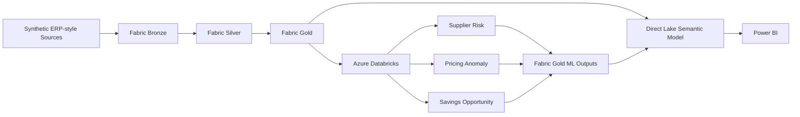
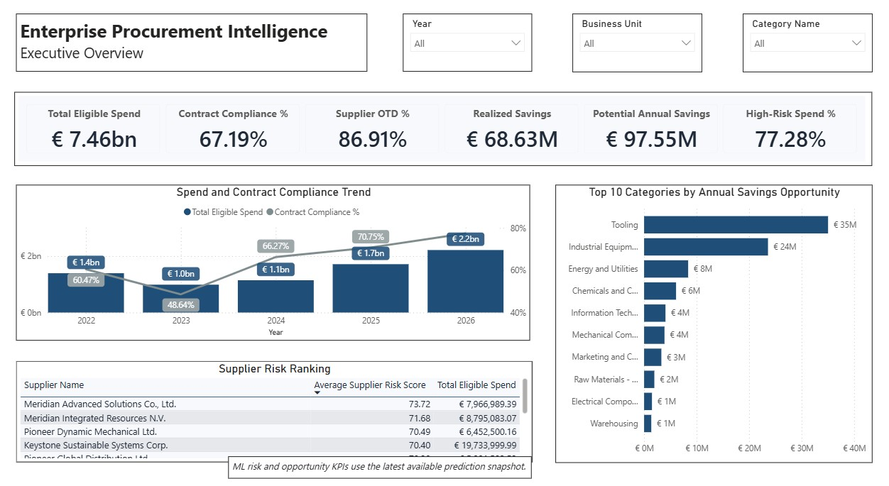
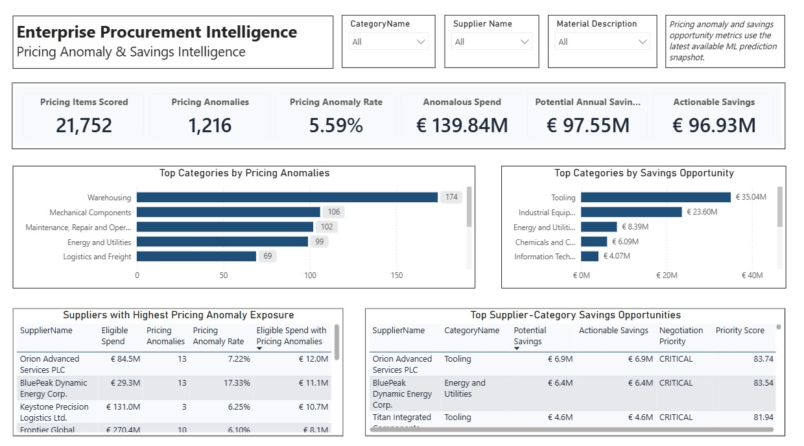
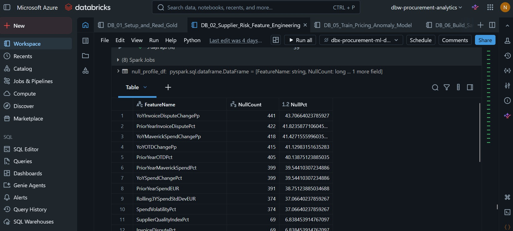
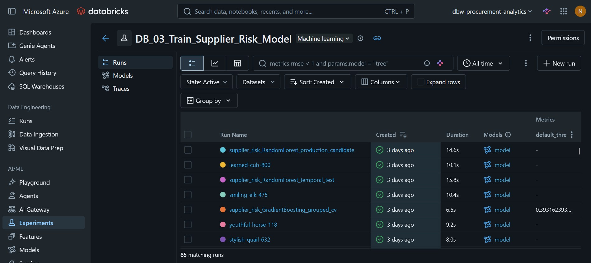
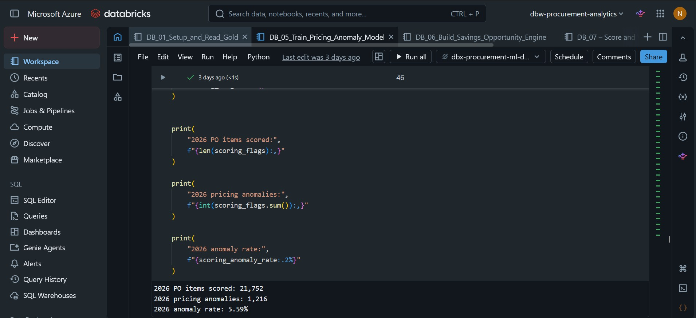
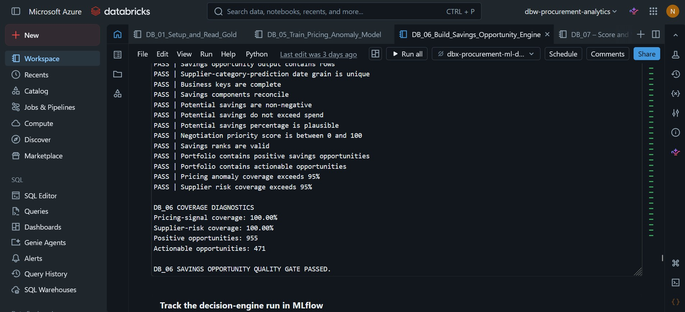
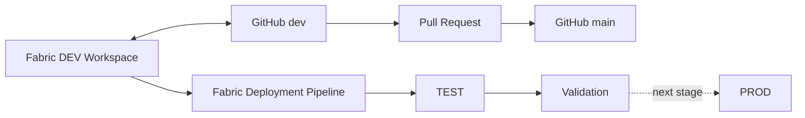
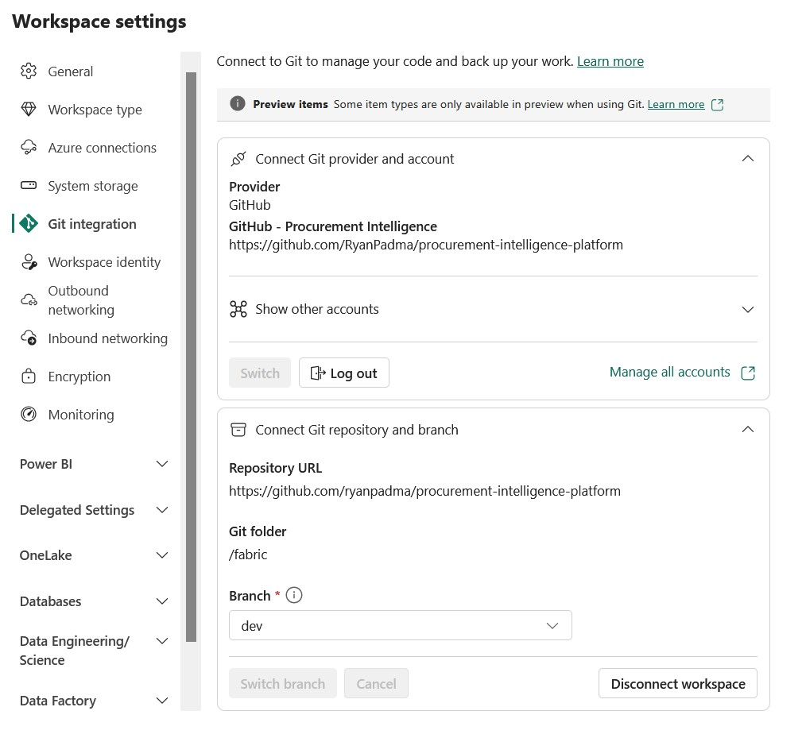

# Enterprise Procurement Intelligence Platform

An end-to-end **procurement analytics engineering portfolio** built with **Microsoft Fabric, Azure Databricks, PySpark, Delta Lake, MLflow, Direct Lake, Power BI, and GitHub**.

The platform demonstrates how ERP-style procurement data can be transformed into governed analytical products, enriched with machine learning and prescriptive analytics, and delivered through a decision-ready semantic model and Power BI reporting layer.

> **Portfolio note:** This project uses synthetic data. Financial values, supplier outcomes, ML predictions, anomalies, and savings opportunities are simulated for demonstration purposes and are not realized business results.

---

## Project at a Glance

```text
Synthetic ERP-style data
        ↓
Microsoft Fabric Bronze
        ↓
Microsoft Fabric Silver
        ↓
Microsoft Fabric Gold
        ↓
Azure Databricks ML & Prescriptive Analytics
        ↓
Fabric Gold ML Outputs
        ↓
Direct Lake Semantic Model
        ↓
Power BI Decision Layer
```

The project demonstrates:

- Medallion architecture in Microsoft Fabric
- PySpark transformation and data-quality engineering
- Delta Lake Bronze, Silver, and Gold layers
- Dimensional modeling and Supplier SCD Type 2
- Governed procurement KPIs
- Supplier risk prediction
- Pricing anomaly detection with Isolation Forest
- Prescriptive supplier-category savings analytics
- MLflow experiment and model management
- ML output promotion back into Fabric Gold
- Direct Lake semantic modeling and DAX
- Power BI decision support
- GitHub source control and pull-request promotion
- Fabric DEV → TEST → PROD deployment pipeline

---

## Explore the Project

| Area | Documentation |
|---|---|
| Platform architecture | [Technical Architecture](docs/architecture/architecture.md) |
| Analytical model | [Data Model](docs/architecture/data-model.md) |
| Data quality | [Data Quality & Validation](docs/data-quality.md) |
| ML lifecycle | [ML Pipeline & Fabric Integration](docs/ml/ml-pipeline.md) |
| Supplier risk | [Supplier Risk Modeling](docs/ml/supplier-risk.md) |
| Pricing anomaly | [Pricing Anomaly Detection](docs/ml/pricing-anomaly.md) |
| Savings opportunity | [Savings Opportunity Engine](docs/ml/savings-opportunity.md) |
| Power BI | [Power BI Report Guide](power-bi/report-guide.md) |
| CI/CD | [CI/CD & Deployment](docs/cicd/CI-CD.md) |

For implementation details, Fabric-generated item definitions are maintained under [`/fabric`](fabric/) and Databricks notebooks under [`/databricks`](databricks/).

---

# Solution Architecture



Bronze preserves synthetic ERP-style master and transaction data. Silver standardizes and enriches it with governed procurement logic. Gold contains the dimensional model, KPI-ready fact tables, Supplier SCD Type 2, and promoted ML outputs.


*Fabric implementation showing the Bronze, Silver, and Gold Lakehouses together with the validation notebook, semantic model, and Power BI report artifacts.*

For the detailed design, see the [Technical Architecture](docs/architecture/architecture.md).

---

# Analytical Model

The Gold analytical layer follows a star-schema-oriented design.

### Dimensions

`dim_date` · `dim_supplier` · `dim_category` · `dim_material` · `dim_buyer` · `dim_business_unit` · `dim_contract` · `dim_currency`

### Facts

`fact_purchase_order` · `fact_invoice` · `fact_savings` · `fact_supplier_performance`

### ML outputs

`ml_supplier_risk_prediction` · `ml_pricing_anomaly_prediction` · `ml_savings_opportunity`

Supplier history uses **SCD Type 2** with version-aware surrogate keys and effective-date logic.


*Core analytical model showing shared dimensions connected to purchase-order, invoice, supplier-performance, and savings facts.*


*ML extension showing supplier-risk, pricing-anomaly, and savings-opportunity tables connected to governed Gold dimensions.*

See the [Data Model](docs/architecture/data-model.md) for grains, relationships, date roles, SCD2 logic, and ML-table design.

---

# Validated Portfolio Snapshot

Selected results from the validated synthetic dataset:

| Metric | Result |
|---|---:|
| Eligible Spend | **€7.46B** |
| Contract Compliance | **67.19%** |
| Maverick Spend | **32.81%** |
| Supplier OTD | **86.91%** |
| Supplier Quality Index | **96%** |
| High-Risk Suppliers | **204** |
| Pricing Items Scored | **21,752** |
| Pricing Anomalies | **1,216** |
| Pricing Anomaly Rate | **5.59%** |
| Anomalous Spend | **€139.84M** |
| Supplier-Category Opportunities | **983** |
| Actionable Opportunities | **471** |
| Modeled Potential Annual Savings | **€97.55M** |
| Realized Savings | **€68.63M** |

These values demonstrate the analytical outputs of the portfolio and should not be interpreted as real procurement results.

---

# Power BI Decision Layer

The final report contains five business-facing pages:

1. **Executive Overview**
2. **Spend & Contract Compliance**
3. **Supplier Performance & Risk**
4. **Pricing Anomaly & Savings Intelligence**
5. **Savings Pipeline & Realization**

<!-- SCREENSHOT: power-bi/screenshots/01-executive-overview.jpg -->


The Executive Overview combines spend, compliance, supplier performance, risk, realized savings, and modeled savings opportunity in one management view.

<!-- SCREENSHOT: power-bi/screenshots/04-pricing-savings-intelligence.jpg -->


The Pricing Anomaly & Savings Intelligence page connects ML pricing signals to supplier-category savings opportunities and negotiation priority.

The report follows a deliberate decision flow:

```text
Executive Performance
        ↓
Spend Governance
        ↓
Supplier Performance & Risk
        ↓
Pricing & Savings Opportunity
        ↓
Savings Execution & Realization
```

The semantic model uses **Direct Lake**, governed relationships, inactive date roles where required, and reusable DAX measures.

See the full [Power BI Report Guide](power-bi/report-guide.md).

---

# Machine Learning & Prescriptive Analytics

Azure Databricks is used for feature engineering, model development, MLflow tracking, scoring, and prescriptive analytics.

```text
Fabric Gold
    ↓
Databricks Feature Engineering / ML
    ↓
MLflow
    ↓
Validated Predictions
    ↓
Fabric Gold ML Tables
    ↓
Direct Lake / Power BI
```

## Supplier Risk

A supervised supplier-level workflow predicts future operational risk using historical delivery, dispute, spend, supplier, and contextual risk features.

The workflow includes future-looking target construction, leakage prevention, grouped cross-validation, temporal holdout testing, candidate-model comparison, MLflow tracking, and Gold promotion.

<!-- SCREENSHOT: docs/screenshots/ml/02-supplier-risk-feature-engineering.jpg -->


*Supplier-risk feature engineering and profiling in Azure Databricks.*

<!-- SCREENSHOT: docs/screenshots/ml/03-mlflow-supplier-risk-experiment.jpg -->


*MLflow evidence showing tracked supplier-risk model-development, temporal-test, and production-candidate runs.*

The selected Random Forest remains an **experimental portfolio baseline** rather than a production-performance claim.

[Read the Supplier Risk documentation →](docs/ml/supplier-risk.md)

---

## Pricing Anomaly Detection

An **Isolation Forest** scores PO items using leakage-safe historical pricing benchmarks.

Validated scoring snapshot:

- **21,752** items scored
- **1,216** anomalies
- **5.59%** anomaly rate

<!-- SCREENSHOT: docs/screenshots/ml/05-pricing-anomaly-results.jpg -->


*2026 production-scoring evidence from Databricks.*

The workflow uses temporal diagnostics and validates anomaly enrichment against independent pricing signals before production scoring.

[Read the Pricing Anomaly documentation →](docs/ml/pricing-anomaly.md)

---

## Savings Opportunity Engine

A prescriptive layer combines pricing signals, maverick-spend leakage, supplier risk, eligible spend, and negotiation potential at **supplier-category grain**.

Validated output:

- **983** supplier-category opportunities
- **955** positive opportunities
- **471** actionable opportunities
- **€97.55M** modeled potential annual savings

<!-- SCREENSHOT: docs/screenshots/ml/06-savings-opportunity-results.jpg -->


*Savings-engine quality-gate evidence showing passed validation, 100% pricing-signal coverage, 100% supplier-risk coverage, and actionable opportunity counts.*

[Read the Savings Opportunity documentation →](docs/ml/savings-opportunity.md)

The complete cross-platform flow is documented in [ML Pipeline & Fabric Integration](docs/ml/ml-pipeline.md).

---

# Data Quality & Validation

Validation is embedded throughout the platform rather than treated as a final reporting step.

Controls include schema validation, duplicate-grain checks, spend reconciliation, contract-compliance reconciliation, Supplier SCD2 as-of alignment, referential-integrity checks, invoice matching validation, ML prediction-grain validation, score-range validation, savings reconciliation, Databricks-to-Fabric reconciliation, and persisted monitoring outputs.

The final Fabric-side validation notebook executed:

**64 validation rules → 64 PASS → 0 FAIL**


*NB_40 evidence confirming the three promoted ML products and the consolidated 64 PASS / 0 FAIL validation result.*

[Read the Data Quality & Validation documentation →](docs/data-quality.md)

---

# CI/CD & Source Control

The project demonstrates a controlled analytics development lifecycle using **GitHub** and **Microsoft Fabric Deployment Pipelines**.



Implemented evidence includes Fabric Git integration, `dev` and `main` branches, pull-request promotion, a DEV → TEST → PROD deployment pipeline, and a successful **33-item DEV → TEST deployment**.

<!-- SCREENSHOT: docs/screenshots/cicd/04-fabric-git-integration.jpg -->


*Fabric DEV workspace connected to the GitHub repository, `/fabric` folder, and `dev` branch.*

<!-- SCREENSHOT: docs/screenshots/cicd/03-merged-pull-request.jpg -->


*Pull-request based promotion of the initial Fabric platform baseline from `dev` into `main`.*

<!-- SCREENSHOT: docs/screenshots/cicd/05-fabric-deployment-pipeline.jpg -->


*Configured Development → Test → Production Fabric deployment pipeline.*

<!-- SCREENSHOT: docs/screenshots/cicd/06-test-deployment-history.jpg -->


*Deployment-history evidence showing the successful 33-item Development → Test promotion.*

Fabric deployment promotes analytical **artifacts**, not physical Delta Lake data. Full target-environment data initialization and Production promotion are documented as productionization extensions.

[Read the CI/CD & Deployment documentation →](docs/cicd/CI-CD.md)

---

# Repository Structure

```text
procurement-intelligence-platform/
│
├── README.md
├── fabric/
├── databricks/
├── docs/
│   ├── architecture/
│   ├── ml/
│   ├── cicd/
│   ├── screenshots/
│   │   ├── fabric/
│   │   ├── ml/
│   │   └── cicd/
│   └── data-quality.md
└── power-bi/
    ├── report-guide.md
    ├── screenshots/
    └── theme/
```

---

# Technology Stack

| Layer | Technology |
|---|---|
| Data platform | Microsoft Fabric |
| Storage | OneLake, Delta Lake |
| Data engineering | PySpark, Spark SQL |
| ML platform | Azure Databricks |
| ML lifecycle | MLflow |
| ML techniques | Random Forest, Isolation Forest |
| Semantic model | Power BI / Fabric Direct Lake |
| BI | Power BI, DAX |
| Source control | GitHub |
| CI/CD | Fabric Git Integration, Deployment Pipelines |

---

# Key Engineering Decisions

- **EUR normalization occurs in Silver** so downstream analytics use a governed reporting currency.
- **Raw contract currency prices are not directly compared with EUR unit prices.**
- **Supplier history uses SCD Type 2** to preserve historical analytical context.
- **Operational supplier performance and ML predictions remain at different grains.**
- **ML prediction dates are not treated as normal transaction dates.**
- **ML outputs return to Fabric Gold before semantic-model consumption.**
- **Data-quality results are persisted as monitoring outputs.**
- **CI/CD versions analytical artifacts, not environment data.**

Detailed rationale is documented in the [Technical Architecture](docs/architecture/architecture.md).

---

# Productionization Roadmap

A production deployment would additionally require automated target-environment initialization, environment-specific configuration and secrets management, automated CI validation gates, full TEST and PROD data orchestration, incremental ingestion patterns, production-grade model monitoring, automated retraining and model governance, expanded role-level security, and production release monitoring.

These items are intentionally documented as extensions rather than represented as completed functionality.

---

# Why This Project

The project was built to demonstrate the connection between **procurement domain knowledge and modern analytics engineering**.

```text
Raw Procurement Data
        ↓
Governed Data Products
        ↓
Machine Learning
        ↓
Prescriptive Analytics
        ↓
Semantic Model
        ↓
Management Action
```

A pricing anomaly becomes useful when its spend exposure is quantified.

A supplier-risk score becomes useful when it is connected to delivery, quality, and procurement exposure.

A savings model becomes useful when it identifies **where procurement should focus and why**.
