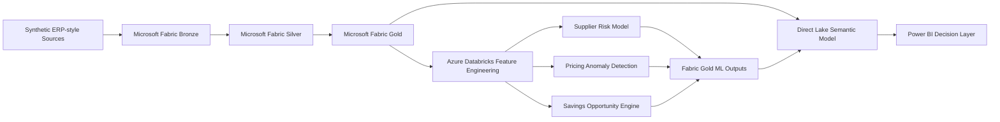
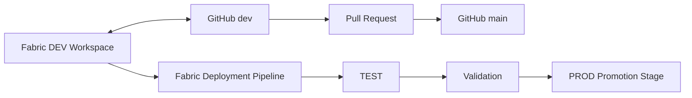

# Enterprise Procurement Intelligence Platform

An end-to-end procurement analytics engineering portfolio project built with **Microsoft Fabric, Azure Databricks, PySpark, Delta Lake, MLflow, Direct Lake, and Power BI**.

The platform demonstrates how raw ERP-style procurement data can be transformed into governed analytical data products, enriched with machine learning and prescriptive analytics, and exposed through a decision-ready semantic model and executive reporting layer.

> **Portfolio note:** The project uses synthetic data. Financial values, supplier results, risks, anomalies, and savings opportunities are simulated for demonstration purposes and should not be interpreted as realized business outcomes.

---

## What this project demonstrates

- Medallion data architecture in Microsoft Fabric
- PySpark transformation and data-quality engineering
- Delta Lake based Bronze, Silver, and Gold layers
- Dimensional modeling and governed procurement KPIs
- Supplier risk modeling in Azure Databricks
- Pricing anomaly detection using Isolation Forest
- Prescriptive supplier-category savings opportunity analytics
- MLflow based experiment/model management
- ML output promotion back into Fabric Gold
- Direct Lake semantic modeling
- DAX business measures and Power BI reporting
- GitHub source control with `dev` and `main` branches
- Pull-request based promotion
- Microsoft Fabric DEV → TEST → PROD deployment pipeline

---

## Business questions addressed

- How much eligible spend is contract compliant?
- Where is maverick spend concentrated?
- Which suppliers have the weakest delivery and quality performance?
- Which suppliers are predicted to carry higher risk?
- Which purchasing transactions exhibit unusual pricing behavior?
- Which supplier-category combinations offer the greatest savings potential?
- How large is the savings pipeline, and how much has been realized?

Core KPI domains include Contract Compliance %, Maverick Spend %, Supplier OTD %, Supplier Quality Index, Three-Way Match %, Invoice Exception %, Supplier Risk Score, Pricing Anomaly Rate, Potential Annual Savings, Savings Forecast, Approved Savings, and Realized Savings.

---

## Solution architecture



### Data architecture

**Bronze**
- Raw synthetic procurement source data
- ERP-style master and transactional entities
- Delta Lake persistence

**Silver**
- Standardization and cleansing
- Currency normalization to EUR
- Contract/spend governance logic
- Invoice matching logic
- Supplier performance derivation
- Data-quality monitoring outputs

**Gold**
- Dimensional model
- SCD Type 2 supplier dimension
- Governed fact tables
- Procurement KPI-ready measures
- ML prediction outputs
- Referential-integrity and reconciliation controls

---

## Analytical model

### Dimensions
- `dim_date`
- `dim_supplier`
- `dim_category`
- `dim_material`
- `dim_buyer`
- `dim_business_unit`
- `dim_contract`
- `dim_currency`

### Facts
- `fact_purchase_order`
- `fact_invoice`
- `fact_savings`
- `fact_supplier_performance`

### ML outputs
- `ml_supplier_risk_prediction`
- `ml_pricing_anomaly_prediction`
- `ml_savings_opportunity`

Supplier history is modeled using **SCD Type 2**, with version-aware surrogate keys and effective-date logic.

---

## Machine learning and prescriptive analytics

### Supplier risk prediction

Azure Databricks is used to engineer supplier-level features and train a baseline supplier risk model.

Example feature domains include late-delivery behavior, dispute history, spend volatility, country/risk attributes, and synthetic financial/ESG-style indicators.

The current model is an experimental portfolio baseline rather than a production claim. Model evaluation is retained as part of the project to demonstrate transparent ML validation.

### Pricing anomaly detection

Purchasing transactions are scored using **Isolation Forest**.

Latest validated scoring snapshot:

- **21,752** PO items scored
- **1,216** pricing anomalies
- **5.59%** anomaly rate

### Savings opportunity engine

A prescriptive analytics layer ranks supplier-category combinations using pricing anomaly signals, maverick-spend leakage, supplier risk, annualized eligible spend, and negotiation potential.

Latest validated synthetic portfolio snapshot:

- **983** supplier-category opportunities
- **955** positive savings opportunities
- **471** actionable opportunities
- **€97.55M** modeled potential annual savings

These figures are simulated portfolio outputs, not realized business savings.

---

## Power BI decision layer

The final report contains five business-facing pages:

1. **Executive Overview**
2. **Spend & Contract Compliance**
3. **Supplier Performance & Risk**
4. **Pricing Anomaly & Savings Intelligence**
5. **Savings Pipeline & Realization**

Selected validated headline metrics from the synthetic dataset include:

| Metric | Result |
|---|---:|
| Eligible Spend | €7.46B |
| Contract Compliance | 67.19% |
| Maverick Spend | 32.81% |
| Supplier OTD | 86.91% |
| High-Risk Suppliers | 204 |
| Pricing Items Scored | 21,752 |
| Pricing Anomalies | 1,216 |
| Pricing Anomaly Rate | 5.59% |
| Modeled Potential Annual Savings | €97.55M |
| Realized Savings in Synthetic Savings Pipeline | €68.63M |

The semantic model uses a **Direct Lake** architecture with governed relationships, inactive date roles where required, and DAX measures for business logic.

---

## Data quality and validation

Validation is embedded throughout the platform rather than treated as a final reporting step.

Examples include:

- Schema validation
- Duplicate-grain checks
- Spend reconciliation
- Contract-compliance reconciliation
- Supplier SCD2 as-of alignment
- Referential-integrity controls
- ML prediction-grain validation
- Score-range validation
- Savings reconciliation
- Databricks-to-Fabric source reconciliation
- Monitoring persistence

The final Fabric-side ML validation notebook executed **64 validation rules with 64 PASS and 0 FAIL** in the validated DEV environment.

---

## CI/CD and source control

The project uses Microsoft Fabric's native Git integration and deployment pipelines to demonstrate a controlled analytics development lifecycle.

### Source control

- `dev` is used as the active development branch
- `main` represents the stable reviewed baseline
- Fabric workspace definitions are synchronized into `/fabric`
- Changes are promoted from `dev` to `main` through pull requests

### Deployment

A three-stage Microsoft Fabric deployment pipeline was configured:

```text
Development → Test → Production
```

The initial **Development → Test** artifact deployment was completed successfully and validated.

### Environment data strategy

Fabric artifact deployment does not copy physical Delta Lake table data between environments.

A production implementation would therefore use:

```text
Git / Artifact Deployment
        ↓
Target Environment Initialization
        ↓
Pipeline / Notebook Orchestration
        ↓
Data Quality Validation
        ↓
Release Approval
```

For this portfolio implementation, DEV → TEST artifact promotion was validated. Full physical data initialization and Production promotion are documented as the next productionization step rather than duplicating the synthetic portfolio dataset across environments.

---

## CI/CD workflow



---

## Repository structure

```text
procurement-intelligence-platform/
│
├── README.md
├── fabric/
│   ├── notebooks and Fabric item definitions
│   ├── lakehouse definitions
│   ├── semantic model artifacts
│   └── Power BI report artifacts
├── databricks/
│   ├── supplier-risk/
│   ├── pricing-anomaly/
│   └── savings-opportunity/
├── docs/
│   ├── architecture/
│   ├── screenshots/
│   └── cicd/
└── power-bi/
    ├── screenshots/
    └── theme/
```

The `/fabric` directory is managed through Fabric Git integration. Databricks notebooks and portfolio documentation are maintained separately for readability.

---

## Technology stack

| Layer | Technology |
|---|---|
| Data platform | Microsoft Fabric |
| Storage | OneLake, Delta Lake |
| Data engineering | PySpark, Spark SQL |
| ML platform | Azure Databricks |
| ML lifecycle | MLflow |
| ML techniques | Random Forest, Isolation Forest |
| Semantic model | Microsoft Fabric / Power BI Direct Lake |
| BI | Power BI, DAX |
| Source control | GitHub |
| CI/CD | Fabric Git Integration, Deployment Pipelines |

---

## Engineering decisions

- **EUR normalization occurs in Silver** so downstream analytics use a governed currency basis.
- **Raw contract currency prices are not directly compared to EUR unit prices.**
- **Supplier history uses SCD Type 2** to preserve historical dimensional context.
- **Operational supplier performance and ML prediction snapshots are modeled at different grains.**
- **ML prediction dates are not treated as normal transaction dates.**
- **Data-quality rules are persisted as monitoring outputs.**
- **Model outputs are promoted back to Fabric Gold before semantic-model consumption.**
- **CI/CD versions analytical artifacts, not environment data.**

---

## Limitations and productionization roadmap

This is a portfolio implementation using synthetic data.

A production deployment would additionally include:

- Automated target-environment initialization after deployment
- Environment-specific configuration and secrets management
- Automated CI validation checks
- Full TEST and PROD data orchestration
- Production-grade model monitoring
- Incremental ingestion patterns
- Expanded role-level security and access governance
- Production model retraining strategy

These items are intentionally documented as productionization extensions rather than represented as completed functionality.

---

## Why this project

The goal was to demonstrate the connection between analytics engineering and business decision-making:

**Raw procurement data → governed data products → machine learning → semantic model → management action**

A pricing anomaly becomes more useful when its spend exposure is quantified.

A supplier risk score becomes more useful when it is connected to delivery, quality, and procurement spend.

A savings model becomes more useful when it identifies where procurement teams should focus and why.
