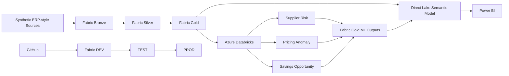

# Enterprise Procurement Intelligence Platform
## Technical Architecture

This document explains how the procurement analytics platform is implemented across **Microsoft Fabric, Azure Databricks, Direct Lake, Power BI, GitHub, and Fabric Deployment Pipelines**.

> **Portfolio note:** The project uses synthetic data. Financial results, supplier risk, anomalies, and savings opportunities are simulated for demonstration purposes.

---

## 1. Architecture at a Glance



The architecture follows three main principles:

1. **Fabric is the governed analytics platform**
2. **Databricks handles ML and prescriptive analytics**
3. **Power BI consumes curated Gold data through Direct Lake**


*Fabric evidence showing the implemented Bronze, Silver, and Gold Lakehouses together with the validation notebook, semantic model, and Power BI report artifacts.*

---

## 2. Platform Components

| Layer | Technology | Purpose |
|---|---|---|
| Storage | OneLake / Delta Lake | Persistent analytical storage |
| Data engineering | Microsoft Fabric + PySpark | Bronze, Silver, Gold processing |
| Machine learning | Azure Databricks | Feature engineering, model training, scoring |
| ML lifecycle | MLflow | Experiment and model management |
| Semantic layer | Direct Lake | Governed relationships and DAX |
| Reporting | Power BI | Procurement decision support |
| Source control | GitHub | `dev` and `main` branches |
| Deployment | Fabric Deployment Pipelines | DEV → TEST → PROD promotion |

---

## 3. Medallion Data Architecture

### Bronze

Bronze preserves synthetic ERP-style source data with minimal business transformation.

Typical source domains include:

- suppliers
- materials and categories
- buyers and business units
- contracts
- purchase orders
- goods receipts
- invoices
- currencies and exchange rates
- savings data

### Silver

Silver standardizes and enriches Bronze data.

Key responsibilities include:

- schema and datatype standardization
- duplicate handling
- EUR normalization
- contract-compliance logic
- maverick-spend logic
- invoice matching
- supplier delivery and quality metrics
- data-quality checks

**Engineering decision:** EUR normalization occurs in Silver so the raw source values remain available while downstream reporting uses a governed currency basis.

### Gold

Gold contains analytics-ready dimensions, facts, and ML outputs.

**Dimensions**

`dim_date` · `dim_supplier` · `dim_category` · `dim_material` · `dim_buyer` · `dim_business_unit` · `dim_contract` · `dim_currency`

**Facts**

`fact_purchase_order` · `fact_invoice` · `fact_savings` · `fact_supplier_performance`

**ML outputs**

`ml_supplier_risk_prediction` · `ml_pricing_anomaly_prediction` · `ml_savings_opportunity`

Gold is the governed consumption boundary for the semantic model and Power BI.

---

## 4. Analytical Model

The Gold layer uses a **star-schema-oriented model** instead of exposing normalized operational tables directly to Power BI.

This provides:

- explicit analytical grains
- reusable dimensions
- controlled relationships
- reusable DAX measures
- easier reconciliation
- historical supplier context

Supplier history uses **SCD Type 2**, preserving version-aware supplier attributes through surrogate keys and effective dates.

<!-- SCREENSHOT: docs/screenshots/fabric/03-core-semantic-model.jpg -->


*Core semantic-model evidence showing shared dimensions connected to purchase-order, invoice, supplier-performance, and savings facts.*

The ML outputs are intentionally modeled separately from the operational facts because prediction snapshots exist at different analytical grains.

<!-- SCREENSHOT: docs/screenshots/fabric/04-ml-semantic-model-extension.jpg -->


*ML extension showing supplier-risk, pricing-anomaly, and savings-opportunity tables connected to governed Gold dimensions.*

For detailed grains, keys, date roles, and SCD2 behavior, see the [Data Model](data-model.md).

---

## 5. Fabric ↔ Databricks ML Flow

Azure Databricks consumes governed Fabric Gold data for feature engineering and ML.

```text
Fabric Gold
    ↓
Databricks Feature Engineering
    ↓
Model Training / Scoring
    ↓
MLflow
    ↓
Validated ML Outputs
    ↓
Fabric Gold ML Tables
    ↓
Direct Lake
```

### Supplier Risk

A supervised model predicts future supplier operational risk using historical delivery, dispute, spend, and contextual supplier features.

### Pricing Anomaly Detection

Isolation Forest identifies unusual purchasing-price behavior.

Validated scoring snapshot:

- **21,752** PO items scored
- **1,216** pricing anomalies
- **5.59%** anomaly rate

### Savings Opportunity Engine

A prescriptive supplier-category layer combines:

- pricing anomalies
- maverick-spend leakage
- supplier risk
- eligible spend
- negotiation potential

Validated synthetic snapshot:

- **983** supplier-category opportunities
- **955** positive opportunities
- **471** actionable opportunities
- **€97.55M** modeled potential annual savings

### Cross-platform connectivity


*DB_01 evidence confirming the Databricks → Fabric OneLake write-back path.*

### Governed ML promotion

ML outputs are not consumed directly from Databricks by Power BI. They are validated and written back into Fabric Gold first.


*DB_07 evidence showing the three validated ML products promoted into physical Fabric Gold tables.*

This keeps the semantic model connected to a governed analytical layer rather than to model-development artifacts.

---

## 6. Direct Lake and Power BI

The semantic model uses **Direct Lake** and provides the business layer between Gold and Power BI.

It manages:

- relationships
- active and inactive date roles
- reusable DAX measures
- procurement KPI definitions

Core KPI areas include:

- Contract Compliance %
- Maverick Spend %
- Supplier OTD %
- Supplier Quality Index
- Three-Way Match %
- Invoice Exception %
- Supplier Risk Score
- Pricing Anomaly Rate
- Potential Annual Savings
- Savings Forecast
- Approved Savings
- Realized Savings

The report contains five business-facing pages:

1. Executive Overview
2. Spend & Contract Compliance
3. Supplier Performance & Risk
4. Pricing Anomaly & Savings Intelligence
5. Savings Pipeline & Realization

<!-- SCREENSHOT: power-bi/screenshots/01-executive-overview.jpg -->


*Power BI evidence showing the governed semantic model translated into an executive procurement decision layer.*

See the [Power BI Report Guide](../../power-bi/report-guide.md) for the complete five-page walkthrough.

---

## 7. Data Quality and Validation

Validation is built into the platform rather than performed only at the reporting stage.

Controls include:

- schema validation
- duplicate-grain checks
- spend reconciliation
- contract-compliance reconciliation
- Supplier SCD2 as-of alignment
- referential-integrity validation
- ML prediction-grain checks
- score-range validation
- savings reconciliation
- Databricks-to-Fabric reconciliation

The final Fabric-side validation notebook executed:

**64 rules → 64 PASS → 0 FAIL**


*NB_40 evidence showing the validated supplier-risk, pricing-anomaly, and savings-opportunity outputs together with the consolidated 64 PASS / 0 FAIL result.*

See [Data Quality & Validation](../data-quality.md) for the validation framework.

---

## 8. Source Control and Deployment

The platform uses GitHub and Fabric Deployment Pipelines as separate but complementary controls.

```text
Fabric DEV Workspace ↔ GitHub dev
                         ↓
                   Pull Request
                         ↓
                    GitHub main
```

The deployment path is:

```text
Development → Test → Production
```

<!-- SCREENSHOT: docs/screenshots/cicd/04-fabric-git-integration.jpg -->


*Fabric DEV workspace connected to the GitHub repository, `/fabric` folder, and `dev` branch.*

<!-- SCREENSHOT: docs/screenshots/cicd/05-fabric-deployment-pipeline.jpg -->


*Configured Development → Test → Production deployment pipeline.*

The initial **33-item DEV → TEST deployment** was completed successfully and validated.

Fabric Deployment Pipelines promote analytical **artifacts**, not physical Delta Lake data. Environment data must therefore be initialized separately.

See [CI/CD & Deployment](../cicd/CI-CD.md) for the complete workflow and deployment evidence.

---

## 9. Key Engineering Decisions

| Decision | Why |
|---|---|
| Bronze / Silver / Gold separation | Separates raw data, business logic, and analytical consumption |
| EUR normalization in Silver | Preserves source values while creating a governed reporting basis |
| Supplier SCD Type 2 | Preserves historical supplier context |
| Star-schema-oriented Gold model | Creates stable analytical grains and reusable dimensions |
| ML outputs return to Fabric Gold | Keeps Power BI on a governed analytical layer |
| ML predictions use separate grains | Prediction snapshots are not operational transactions |
| Persisted validation outputs | Keeps data-quality evidence auditable |
| Git versions artifacts, not environment data | Separates source-controlled definitions from physical data |

---

## 10. Current Scope

### Implemented

- Fabric Bronze, Silver, and Gold layers
- PySpark / Delta transformations
- dimensional analytical model
- Supplier SCD Type 2
- Databricks feature engineering
- supplier-risk modeling
- pricing anomaly detection
- savings opportunity analytics
- MLflow experiment management
- ML promotion back to Fabric Gold
- Direct Lake semantic model
- Power BI reporting
- data-quality validation
- GitHub source control
- Fabric Git integration
- DEV → TEST deployment

### Production extensions

A production implementation would additionally require:

- automated environment initialization
- environment-specific configuration and secrets
- automated CI validation gates
- full TEST and PROD data orchestration
- incremental ingestion
- production model monitoring
- automated retraining
- expanded security and access governance
- production release monitoring and rollback

These are intentionally documented as extensions rather than represented as completed portfolio functionality.

---

## Related Documentation

- [Main README](../../README.md)
- [Data Model](data-model.md)
- [Data Quality & Validation](../data-quality.md)
- [ML Pipeline & Fabric Integration](../ml/ml-pipeline.md)
- [Power BI Report Guide](../../power-bi/report-guide.md)
- [CI/CD & Deployment](../cicd/CI-CD.md)
