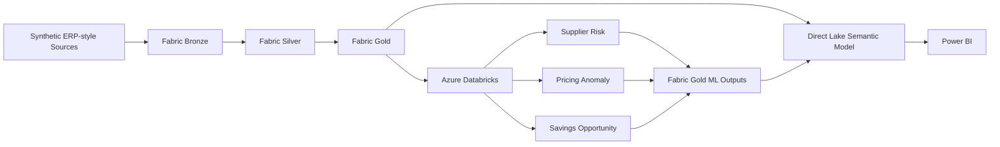

# Enterprise Procurement Intelligence Platform
## Technical Architecture

This document summarizes the architecture of the procurement analytics portfolio and explains how data moves from synthetic ERP-style sources into Microsoft Fabric, Azure Databricks, and Power BI.

> **Portfolio note:** The project uses synthetic data. Financial results, risks, anomalies, and savings opportunities are simulated for demonstration purposes.

---

## 1. Architecture at a Glance



The platform follows three main principles:

1. **Fabric manages the governed analytics platform**
2. **Databricks handles ML and prescriptive analytics**
3. **Power BI consumes curated Gold data through Direct Lake**

---

## 2. Platform Components

| Layer | Technology | Purpose |
|---|---|---|
| Storage | OneLake / Delta Lake | Persistent analytical data |
| Data engineering | Microsoft Fabric + PySpark | Bronze, Silver, Gold transformations |
| Machine learning | Azure Databricks | Feature engineering, training, scoring |
| ML lifecycle | MLflow | Experiment and model management |
| Semantic layer | Fabric / Power BI Direct Lake | Governed relationships and DAX |
| Reporting | Power BI | Decision-ready procurement reporting |
| Source control | GitHub | `dev` and `main` branches |
| Deployment | Fabric Deployment Pipelines | DEV → TEST → PROD promotion |

---

## 3. Medallion Data Architecture

### Bronze

Bronze stores raw synthetic ERP-style procurement data in Delta Lake.

Typical domains include:

- suppliers
- materials and categories
- buyers and business units
- contracts
- purchase orders
- goods receipts
- invoices
- currencies and exchange rates
- savings data

Bronze preserves source-level structure and avoids analytical KPI logic.

### Silver

Silver standardizes and enriches Bronze data.

Main responsibilities:

- schema and datatype standardization
- duplicate handling
- EUR currency normalization
- contract-compliance logic
- maverick-spend logic
- invoice matching
- supplier delivery and quality metrics
- data-quality checks

**Key decision:** EUR normalization happens in Silver so raw source values remain available while downstream analytics use a governed currency basis.

### Gold

Gold contains analytics-ready facts, dimensions, and ML outputs.

#### Dimensions

- `dim_date`
- `dim_supplier`
- `dim_category`
- `dim_material`
- `dim_buyer`
- `dim_business_unit`
- `dim_contract`
- `dim_currency`

#### Facts

- `fact_purchase_order`
- `fact_invoice`
- `fact_savings`
- `fact_supplier_performance`

#### ML outputs

- `ml_supplier_risk_prediction`
- `ml_pricing_anomaly_prediction`
- `ml_savings_opportunity`

Gold is the main consumption layer for the semantic model and Power BI.

---

## 4. Dimensional Modeling

The analytical layer uses a **star schema** rather than exposing normalized operational tables directly to Power BI.

This provides:

- clear analytical grains
- simpler relationships
- reusable DAX measures
- better model readability
- easier reconciliation

### Supplier SCD Type 2

`dim_supplier` uses Slowly Changing Dimension Type 2 logic.

Supplier history is preserved using:

- surrogate keys
- effective dates
- historical versions

This ensures historical transactions remain linked to the supplier attributes that were valid at the time.

---

## 5. Machine Learning Flow

Azure Databricks is used for three analytical use cases.

### Supplier Risk Prediction

Supplier-level features include areas such as:

- delivery performance
- invoice disputes
- spend volatility
- country or risk attributes
- synthetic financial and ESG-style indicators

The model is treated as a portfolio baseline, not a production performance claim.

### Pricing Anomaly Detection

Isolation Forest identifies unusual purchasing-price behavior.

Validated synthetic snapshot:

- **21,752** PO items scored
- **1,216** anomalies
- **5.59%** anomaly rate

### Savings Opportunity Engine

Supplier-category opportunities are ranked using signals such as:

- pricing anomalies
- maverick spend
- supplier risk
- eligible spend
- negotiation potential

Validated synthetic snapshot:

- **983** supplier-category opportunities
- **955** positive savings opportunities
- **471** actionable opportunities
- **€97.55M** modeled potential annual savings

### Integration pattern

```text
Fabric Gold
    ↓
Databricks feature engineering / ML
    ↓
MLflow
    ↓
Validated predictions
    ↓
Fabric Gold ML tables
    ↓
Direct Lake semantic model
```

**Key decision:** ML outputs are written back to Fabric Gold before Power BI consumes them.

---

## 6. Semantic Model and Power BI

The semantic model uses **Direct Lake** and provides the governed business layer between Gold and Power BI.

It manages:

- relationships
- date roles
- DAX measures
- procurement KPI definitions

Core KPI areas include:

- Contract Compliance %
- Maverick Spend %
- Supplier OTD %
- Supplier Quality Index
- Three-Way Match %
- Invoice Exception %
- Supplier Risk Score
- Pricing Anomaly Rate
- Potential Annual Savings
- Savings Forecast
- Approved Savings
- Realized Savings

The Power BI report contains five pages:

1. Executive Overview
2. Spend & Contract Compliance
3. Supplier Performance & Risk
4. Pricing Anomaly & Savings Intelligence
5. Savings Pipeline & Realization

---

## 7. Data Quality and Validation

Validation is built into the data pipeline rather than performed only at the reporting stage.

Examples include:

- schema validation
- duplicate-grain checks
- spend reconciliation
- contract-compliance reconciliation
- SCD2 alignment
- referential-integrity checks
- ML prediction-grain validation
- score-range validation
- savings reconciliation
- Databricks-to-Fabric reconciliation

The final Fabric-side ML validation notebook executed:

**64 rules → 64 PASS → 0 FAIL**

in the validated DEV environment.

---

## 8. Source Control and Deployment

### Git workflow

```text
Fabric DEV Workspace ↔ GitHub dev
                         ↓
                   Pull Request
                         ↓
                    GitHub main
```

- `dev` is the active development branch
- `main` is the reviewed stable baseline
- Fabric item definitions are synchronized under `/fabric`

### Fabric Deployment Pipeline

```text
Development → Test → Production
```

DEV → TEST artifact deployment has been completed and validated.

### Important limitation

Fabric Deployment Pipelines promote **artifacts**, not physical Delta Lake data.

A production deployment would therefore follow:

```text
Artifact deployment
        ↓
Target environment initialization
        ↓
Data orchestration
        ↓
Validation
        ↓
Release approval
```

Full TEST and PROD data initialization is documented as a productionization extension.

---

## 9. Key Engineering Decisions

| Decision | Why |
|---|---|
| Bronze / Silver / Gold separation | Keeps raw data, business logic, and analytics concerns separate |
| EUR normalization in Silver | Preserves raw values while creating a governed reporting currency |
| Supplier SCD Type 2 | Preserves historical supplier context |
| ML outputs return to Fabric Gold | Keeps Power BI on a governed analytical layer |
| ML predictions use separate grains | Prediction snapshots are not operational transactions |
| Data-quality results are persisted | Validation remains auditable and reusable |
| Git versions artifacts, not data | Environment data is managed separately from source-controlled definitions |

---

## 10. Current Scope vs. Production Extensions

### Implemented in the portfolio

- Fabric Bronze, Silver, and Gold layers
- PySpark transformations
- Delta Lake persistence
- dimensional model
- Supplier SCD Type 2
- Databricks ML workflows
- MLflow
- pricing anomaly detection
- supplier risk modeling
- savings opportunity analytics
- ML output promotion to Fabric Gold
- Direct Lake semantic model
- Power BI reporting
- data-quality validation
- GitHub source control
- Fabric Git integration
- DEV → TEST deployment

### Future productionization

- automated environment initialization
- secrets and environment-specific configuration
- automated CI validation gates
- full TEST and PROD data orchestration
- incremental ingestion
- production model monitoring
- automated retraining
- expanded security and access governance

---

## 11. Repository Structure

```text
procurement-intelligence-platform/
│
├── README.md
├── fabric/
├── databricks/
│   ├── supplier-risk/
│   ├── pricing-anomaly/
│   └── savings-opportunity/
├── docs/
│   ├── architecture/
│   ├── screenshots/
│   └── cicd/
└── power-bi/
    ├── screenshots/
    └── theme/
```

The main README provides the project overview. This document explains the architecture in more detail without duplicating implementation-level notebook documentation.
