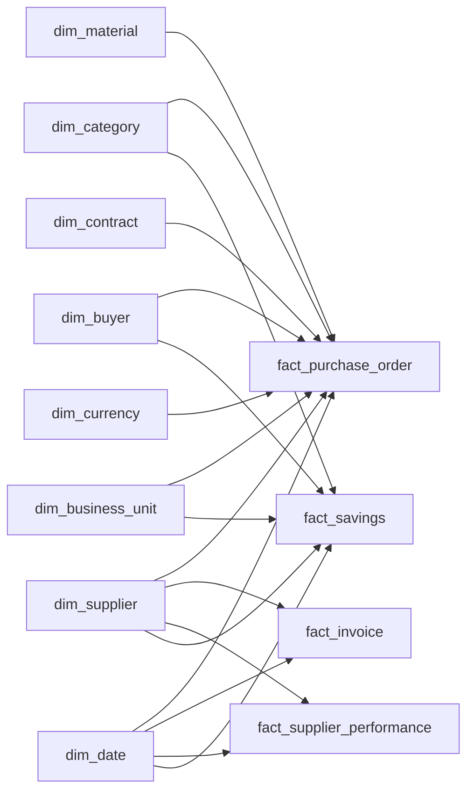

# Enterprise Procurement Intelligence Platform
## Analytical Data Model

This document describes the **Gold analytical model** used by the procurement intelligence platform and the modeling rules that support Direct Lake and Power BI.

> **Scope:** This page focuses on table grain, dimensions, facts, relationships, Supplier SCD Type 2, date roles, and ML output integration. Platform architecture is documented separately in [`architecture.md`](architecture.md).

---

## 1. Model at a Glance

The Gold layer uses a **star-schema-oriented analytical model**.



The model separates:

- descriptive business entities into **dimensions**
- measurable procurement processes into **facts**
- machine-learning predictions and prescriptive outputs into dedicated **ML tables**

---

## 2. Implemented Semantic Model

The screenshots below show the implemented Fabric/Power BI semantic model rather than only a conceptual design.

<!-- SCREENSHOT: docs/screenshots/fabric/03-core-semantic-model.jpg -->


*Core model evidence showing the shared dimensions and the four main analytical facts: purchase orders, invoices, supplier performance, and savings.*

The core view demonstrates that the model is designed around reusable dimensions instead of fact-to-fact reporting logic.

<!-- SCREENSHOT: docs/screenshots/fabric/04-ml-semantic-model-extension.jpg -->


*ML extension showing supplier-risk, pricing-anomaly, and savings-opportunity outputs connected back to governed Gold dimensions.*

This separation is intentional: ML prediction snapshots have different grains from operational procurement facts.

---

## 3. Core Modeling Principles

### Explicit grain

Every fact and ML table has one defined analytical grain.

Measures are calculated from that grain rather than from mixed header/line or mixed operational/prediction records.

### Conformed dimensions

Shared dimensions are reused across business processes so filtering behaves consistently across spend, invoice, supplier-performance, savings, and ML analysis.

### Surrogate keys

Gold dimensions use analytical surrogate keys rather than relying only on source-system business keys.

This is especially important for historical Supplier SCD Type 2 resolution.

### Historical correctness

Supplier history is preserved through effective-dated versions instead of overwriting current attributes onto historical transactions.

### Separate ML grains

Prediction and opportunity tables remain separate from operational facts.

For example:

```text
Supplier Performance Event
        ≠
Supplier Risk Prediction Snapshot
```

and:

```text
Savings Project / Realization
        ≠
Modeled Savings Opportunity
```

---

## 4. Dimension Tables

| Dimension | Purpose |
|---|---|
| `dim_date` | Shared calendar and date-role filtering |
| `dim_supplier` | Governed supplier master with SCD Type 2 history |
| `dim_category` | Procurement category classification |
| `dim_material` | Material/item analytical context |
| `dim_buyer` | Procurement buyer and ownership context |
| `dim_business_unit` | Organizational reporting context |
| `dim_contract` | Contract validity and commercial context |
| `dim_currency` | Currency reference and source-currency context |

### `dim_supplier` and SCD Type 2

Supplier history is preserved using version-aware records with:

- Supplier business key
- Supplier surrogate key
- effective-from date
- effective-to date
- current-version indicator

Conceptually:

```text
Supplier A
├── Version 1: historical attributes
└── Version 2: current attributes
```

Historical transactions resolve to the supplier version valid at the relevant transaction date.

This prevents a current supplier classification from silently rewriting historical reporting.

---

## 5. Fact Tables

### `fact_purchase_order`

**Primary role:** Procurement spend and contract-governance analysis.

**Grain:** Purchase-order item / analytical transaction level.

Supports:

- eligible spend
- contract-compliant spend
- maverick spend
- supplier/category/material spend
- pricing analysis
- pricing-anomaly linkage

**Modeling rule:** Header-level and line-level values are not mixed in a way that duplicates spend.

---

### `fact_invoice`

**Primary role:** Invoice and matching analytics.

Supports:

- invoice value
- invoice exceptions
- dispute analysis
- three-way matching
- payment/invoice performance

Invoice activity remains separate from purchase-order activity because invoices have their own dates, statuses, and matching logic.

---

### `fact_supplier_performance`

**Primary role:** Historical operational supplier performance.

Supports:

- Supplier OTD %
- delivery performance
- quality indicators
- invoice-dispute indicators
- supplier performance trends

This fact is deliberately separate from the supplier-risk ML table.

---

### `fact_savings`

**Primary role:** Savings pipeline and realization.

Supports:

- forecasted savings
- weighted forecast
- approved savings
- realized savings
- savings status
- buyer/business-unit ownership

This represents the savings execution lifecycle, not theoretical ML opportunity.

---

## 6. ML Output Tables

The three ML outputs are persisted in Gold before Direct Lake consumption.

| Table | Analytical grain | Purpose |
|---|---|---|
| `ml_supplier_risk_prediction` | Supplier × Prediction Date | Predictive supplier-risk snapshot |
| `ml_pricing_anomaly_prediction` | PO Item × Prediction Date | Pricing anomaly score and flag |
| `ml_savings_opportunity` | Supplier × Category × Prediction Date | Prescriptive sourcing opportunity |

### Supplier risk

`ml_supplier_risk_prediction` stores the current prediction snapshot, including the risk score/classification and model lineage fields.

It is not treated as historical operational performance.

### Pricing anomaly

`ml_pricing_anomaly_prediction` retains PO-item-level anomaly scoring so unusual transactions can be analyzed by supplier, category, contract, and material context.

### Savings opportunity

`ml_savings_opportunity` stores supplier-category opportunities and negotiation prioritization.

It remains separate from `fact_savings` because:

```text
Modeled Future Opportunity
        ≠
Approved / Realized Savings
```

---

## 7. ML Gold Promotion Evidence

The ML tables are not conceptual placeholders. They are validated in Databricks and promoted back into Fabric Gold.

<!-- SCREENSHOT: docs/screenshots/ml/07-ml-output-promotion-validation.jpg -->


*DB_07 evidence showing the validated supplier-risk, pricing-anomaly, and savings-opportunity data products written into physical Fabric Gold tables.*

Validated snapshot:

| Gold ML product | Rows |
|---|---:|
| Supplier Risk Prediction | **356** |
| Pricing Anomaly Prediction | **21,752** |
| Savings Opportunity | **983** |

The promotion process also validates Gold key mappings, analytical grain, score ranges, and reconciliation before semantic-model consumption.

---

## 8. Relationship Strategy

The model primarily follows **one-to-many dimension-to-fact relationships**.

```text
Dimension 1 ───────< Fact many
```

This supports consistent filtering without depending on unnecessary fact-to-fact relationships.

Examples include:

```text
dim_supplier      → fact_purchase_order
dim_supplier      → fact_invoice
dim_supplier      → fact_supplier_performance

dim_category      → fact_purchase_order
dim_category      → fact_savings

dim_business_unit → fact_purchase_order
dim_business_unit → fact_savings
```

Where the report needs to compare multiple business processes, shared dimensions provide the analytical context.

---

## 9. Date Roles

Procurement data contains multiple meaningful dates, including:

- PO date
- invoice date
- due date
- savings date
- supplier-performance period
- prediction date

The semantic model uses a shared `dim_date` with active and inactive relationships where appropriate.

DAX activates alternative date roles only when required.

### Prediction dates

ML prediction dates are not treated as normal transaction dates.

For example, the supplier-risk score shown in Power BI uses the latest prediction snapshot while operational supplier-performance KPIs can still be filtered historically.

This preserves the difference between:

```text
Historical Operational Date
        and
ML Prediction Snapshot Date
```

---

## 10. Currency Modeling

The model separates:

1. **source currency context**
2. **governed EUR analytical values**

EUR normalization occurs upstream in Silver.

Gold therefore receives standardized values for enterprise reporting while retaining relevant currency references.

**Important rule:** raw contract prices in one currency are not directly compared with transaction prices expressed in another currency.

---

## 11. SCD2 Supplier Alignment

Supplier SCD2 requires facts to resolve to the correct historical supplier version.

Conceptually:

```text
Transaction Date
      +
Supplier Business Key
      ↓
EffectiveFrom <= Transaction Date
      AND
Transaction Date < EffectiveTo
      ↓
Correct Supplier Surrogate Key
```

Validation checks that:

- supplier effective-date ranges do not overlap incorrectly
- fact rows resolve to valid supplier versions
- current/historical flags remain consistent
- no unintended supplier-key gaps are introduced

---

## 12. Data Quality Controls Affecting the Model

The Gold model is validated for issues that could distort reporting.

Key controls include:

- duplicate fact grain
- duplicate dimension keys
- orphaned foreign keys
- Supplier SCD2 alignment
- spend reconciliation
- contract-compliance reconciliation
- ML output grain validation
- ML score-range validation
- savings reconciliation

The final Fabric-side ML validation completed:

**64 rules → 64 PASS → 0 FAIL**

in the validated DEV environment.

For the full validation framework, see [Data Quality & Validation](../data-quality.md).

---

## 13. Semantic Model vs. Upstream Responsibilities

The Gold and semantic layers have deliberately different responsibilities.

### Upstream Fabric processing

Handles:

- cleansing
- standardization
- EUR conversion
- contract/compliance classification
- Supplier SCD Type 2
- invoice matching
- ML output promotion
- validation and reconciliation

### Direct Lake semantic model

Handles:

- relationships
- date-role behavior
- DAX measures
- KPI definitions
- report-facing formatting and analytical behavior

Power BI therefore does not recreate upstream data-engineering or ML logic.

---

## 14. Model Design Summary

| Area | Decision |
|---|---|
| Overall model | Star-schema-oriented |
| Supplier history | SCD Type 2 |
| Fact design | Explicit grain by business process |
| Shared filtering | Conformed dimensions |
| Currency | EUR normalization upstream in Silver |
| Date handling | Shared date dimension with role-playing relationships |
| ML predictions | Separate analytical tables |
| ML consumption | Promoted into Fabric Gold |
| BI access | Direct Lake semantic model |
| Validation | Grain, key, reconciliation, and referential-integrity checks |

---

## Related Documentation

- [Main README](../../README.md)
- [Technical Architecture](architecture.md)
- [Data Quality & Validation](../data-quality.md)
- [ML Pipeline & Fabric Integration](../ml/ml-pipeline.md)
- [Power BI Report Guide](../../power-bi/report-guide.md)
