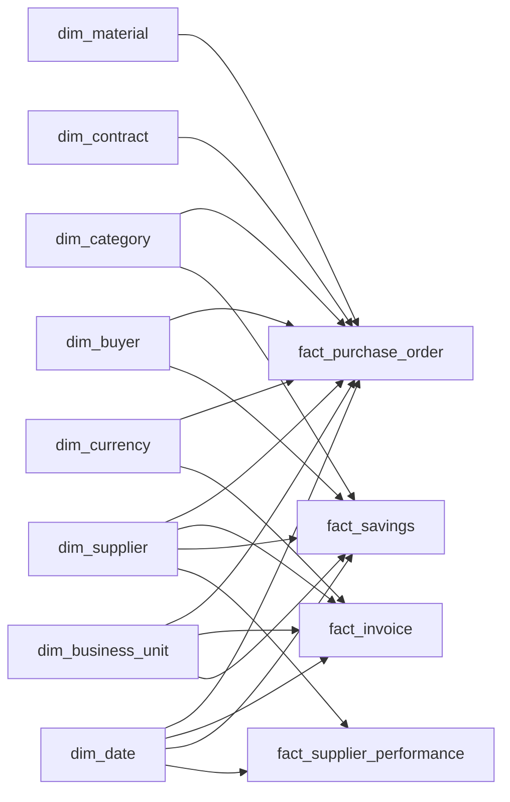

# Enterprise Procurement Intelligence Platform
## Analytical Data Model

This document describes the Gold analytical model used by the procurement intelligence platform and the modeling rules that support Direct Lake and Power BI.

> **Scope:** This page focuses on analytical grain, table roles, relationships, historical modeling, and ML output integration. Pipeline and platform architecture are documented separately in `architecture.md`.

---

## 1. Model Overview

The Gold layer uses a **star-schema-oriented analytical model**.



The model separates:

- descriptive business entities into **dimensions**
- measurable procurement events into **facts**
- model predictions and prescriptive outputs into dedicated **ML tables**

---

## 2. Core Modeling Principles

### Clear grain

Every fact and ML table must have one explicit grain.

Measures should be calculated from that grain rather than from ambiguous mixed-level records.

### Surrogate keys

Gold dimensions use analytical keys rather than relying only on operational business keys.

This is especially important for supplier history.

### Historical correctness

Supplier history is modeled using **SCD Type 2** so historical transactions can resolve to the supplier version that was valid at the relevant time.

### Shared dimensions

Facts reuse common dimensions wherever possible.

This allows supplier, category, business-unit, buyer, date, and currency analysis to behave consistently across reporting domains.

### ML outputs remain separate

ML prediction tables are not forced into operational fact grains.

Prediction snapshots and transaction facts represent different analytical events and are modeled separately.

---

# 3. Dimensions

## `dim_date`

**Purpose:** Shared calendar dimension for procurement analysis.

Typical use cases:

- purchase-order dates
- invoice dates
- savings dates
- performance periods

The semantic model uses inactive date relationships where multiple date roles are required.

---

## `dim_supplier`

**Purpose:** Governed supplier master with historical context.

### Key characteristics

- Supplier business key
- Supplier surrogate key
- supplier attributes
- effective start date
- effective end date
- current-version indicator

### SCD Type 2

When tracked supplier attributes change, a new dimension version is created instead of overwriting the historical record.

Conceptually:

```text
Supplier A
├── Version 1: valid until 2025-12-31
└── Version 2: valid from 2026-01-01
```

Historical facts resolve to the supplier version valid at the transaction or analytical reference date.

---

## `dim_category`

**Purpose:** Procurement category classification.

Supports analysis such as:

- spend by category
- contract compliance by category
- pricing anomalies by category
- savings opportunity by category

---

## `dim_material`

**Purpose:** Material-level analytical context.

Supports:

- item-level spend analysis
- material/category hierarchy
- pricing comparisons
- purchasing-pattern analysis

---

## `dim_buyer`

**Purpose:** Buyer or procurement-owner context.

Used for:

- buyer-level spend
- savings ownership
- procurement workload
- operational accountability

---

## `dim_business_unit`

**Purpose:** Organizational reporting context.

Used for:

- spend by entity or business unit
- compliance comparison
- savings ownership
- management reporting

---

## `dim_contract`

**Purpose:** Contract context used by procurement facts and compliance logic.

Typical attributes include:

- contract identifier
- supplier/category scope
- contract validity
- contract type/status
- contract ownership
- currency and commercial context

Contract logic is prepared upstream so Power BI does not independently determine contract eligibility.

---

## `dim_currency`

**Purpose:** Currency reference for financial analysis.

The model retains original currency context while downstream measures use EUR-normalized analytical values produced in Silver.

---

# 4. Fact Tables

## `fact_purchase_order`

**Primary role:** Core procurement spend fact.

### Grain

Purchase-order transaction level used by the Gold model, typically aligned to PO item/line analysis.

### Supports

- eligible spend
- contract-compliant spend
- maverick spend
- supplier/category/material spend
- purchase price analysis
- pricing anomaly linkage

### Important rule

The grain must remain stable. Header-level and line-level amounts should not be mixed in a way that creates duplicated spend.

---

## `fact_invoice`

**Primary role:** Invoice and matching analytics.

### Supports

- invoice value
- invoice exceptions
- three-way match metrics
- dispute analysis
- payment/invoice performance

Invoice facts are modeled separately from purchase orders because invoice events have their own dates, statuses, and business logic.

---

## `fact_savings`

**Primary role:** Savings pipeline and realization.

### Supports

- savings forecast
- approved savings
- realized savings
- savings status
- buyer/business-unit ownership

The savings fact represents the procurement savings lifecycle rather than purchase transactions.

---

## `fact_supplier_performance`

**Primary role:** Operational supplier-performance analytics.

### Supports

- Supplier OTD %
- delivery performance
- quality indicators
- supplier performance trends

### Grain

Supplier performance is modeled at its own operational reporting grain.

It should not be treated as equivalent to an ML supplier-risk prediction snapshot.

---

# 5. ML Output Tables

## `ml_supplier_risk_prediction`

**Purpose:** Supplier-risk model output.

### Grain

Supplier prediction snapshot.

Typical fields include:

- supplier key
- prediction date
- risk score/probability
- predicted risk class
- model/version metadata where retained

### Modeling rule

Prediction date is not treated as a normal transaction date.

Supplier risk is joined to supplier context while preserving the distinct prediction-snapshot grain.

---

## `ml_pricing_anomaly_prediction`

**Purpose:** Transaction-level pricing anomaly output.

### Grain

Scored purchase-order item.

Validated portfolio snapshot:

- **21,752** items scored
- **1,216** anomalies
- **5.59%** anomaly rate

Typical analytical fields:

- PO item reference
- anomaly score
- anomaly flag

This table is connected back to purchasing context so anomalies can be evaluated by supplier, category, spend, and business unit.

---

## `ml_savings_opportunity`

**Purpose:** Prescriptive procurement opportunity output.

### Grain

Supplier-category opportunity.

Validated synthetic snapshot:

- **983** supplier-category opportunities
- **955** positive savings opportunities
- **471** actionable opportunities
- **€97.55M** modeled potential annual savings

The table is intentionally not merged into `fact_savings`.

`fact_savings` represents the savings pipeline and realization process, while `ml_savings_opportunity` represents modeled future opportunity.

---

# 6. Relationship Strategy

The semantic model primarily uses **one-to-many dimension-to-fact relationships**.

Conceptually:

```text
Dimension 1 ───────< Fact many
```

Examples:

```text
dim_supplier      → fact_purchase_order
dim_supplier      → fact_invoice
dim_supplier      → fact_supplier_performance

dim_category      → fact_purchase_order
dim_category      → fact_savings

dim_business_unit → fact_purchase_order
dim_business_unit → fact_invoice
dim_business_unit → fact_savings
```

The goal is to avoid unnecessary fact-to-fact relationships.

Where analytical comparison between facts is required, shared dimensions provide the filtering context.

---

# 7. Date Roles

Procurement data contains multiple meaningful dates.

Examples include:

- PO date
- invoice date
- due date
- savings date
- supplier-performance period
- prediction date

The model uses a shared `dim_date`, with inactive relationships where appropriate.

DAX activates alternative date roles only when required.

This avoids duplicating date logic and keeps time intelligence governed.

---

# 8. Currency Modeling

The model separates:

1. **source currency context**
2. **governed EUR analytical values**

EUR conversion occurs in Silver.

Gold therefore receives already-standardized values for cross-company reporting while retaining relevant currency references.

### Modeling rule

Raw contract prices in one currency must not be compared directly with transaction unit prices expressed in another currency.

---

# 9. SCD2 Supplier Alignment

Supplier SCD2 requires facts to resolve to the correct supplier version.

Conceptually:

```text
Transaction date
      ↓
Supplier business key
      ↓
Find supplier version where:
EffectiveFrom <= TransactionDate
AND
TransactionDate < EffectiveTo
      ↓
Supplier surrogate key
```

This ensures historical supplier analysis remains correct after supplier attributes change.

SCD2 alignment is validated before the model is considered reporting-ready.

---

# 10. Data Quality Rules Affecting the Model

The Gold model is validated for issues that could produce incorrect reporting.

Key controls include:

- duplicate fact grain
- duplicate dimension keys
- orphaned foreign keys
- invalid SCD2 alignment
- spend reconciliation
- contract-compliance reconciliation
- ML output grain validation
- ML score-range validation
- savings reconciliation

The validated DEV environment completed **64 validation rules with 64 PASS and 0 FAIL** in the final Fabric-side ML validation notebook.

---

# 11. Semantic Model Responsibilities

The Gold model provides the structural analytical layer.

The Direct Lake semantic model adds:

- relationships
- active/inactive date roles
- DAX measures
- KPI definitions
- report-facing formatting and behavior

Core measures include:

- Contract Compliance %
- Maverick Spend %
- Supplier OTD %
- Supplier Quality Index
- Three-Way Match %
- Invoice Exception %
- Supplier Risk Score
- Pricing Anomaly Rate
- Potential Annual Savings
- Savings Forecast
- Approved Savings
- Realized Savings

The semantic model should calculate business measures, but it should not recreate upstream cleansing or data-engineering logic.

---

# 12. Model Design Summary

| Design area | Decision |
|---|---|
| Overall model | Star-schema-oriented |
| Supplier history | SCD Type 2 |
| Fact design | Explicit grain per business process |
| Shared filtering | Conformed dimensions |
| Currency | EUR normalization upstream in Silver |
| Date handling | Shared date dimension with role-playing relationships |
| ML predictions | Separate analytical tables |
| ML consumption | Promoted back into Fabric Gold |
| BI access | Direct Lake semantic model |
| Validation | Reconciliation and referential-integrity checks before reporting |

---

## Related Documentation

- `README.md` — project overview
- `docs/architecture/architecture.md` — platform architecture
- `docs/data-quality.md` — validation and monitoring
- `docs/ml/` — machine-learning implementation
- `docs/cicd/` — source control and deployment
