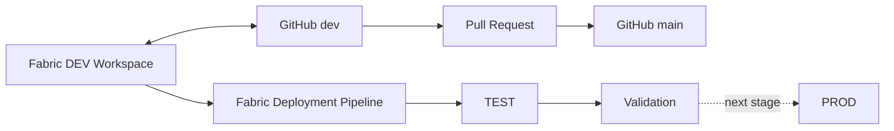

# CI/CD & Deployment

This document explains how **GitHub source control**, **Microsoft Fabric Git Integration**, and **Fabric Deployment Pipelines** are used to manage the procurement intelligence platform from development through controlled environment promotion.

> **Portfolio scope:** The implementation demonstrates source control, branch governance, pull-request promotion, Fabric Git synchronization, and a validated **DEV → TEST artifact deployment**. Full TEST/PROD data initialization and Production promotion are documented as productionization extensions.

---

## 1. Delivery Lifecycle



The platform deliberately separates two concerns:

- **GitHub** manages version history, branches, review, and the stable code baseline.
- **Fabric Deployment Pipelines** promote supported analytical artifacts between environments.

This prevents source control and environment promotion from being treated as the same process.

---

## 2. Fabric Artifacts Under Source Control

Fabric-generated item definitions are synchronized into the repository under:

```text
/fabric
```

The repository therefore contains version-controlled Fabric artifacts rather than only external screenshots or manually recreated code.

<!-- SCREENSHOT: docs/screenshots/cicd/01-github-fabric-artifacts.jpg -->


*GitHub evidence showing the Fabric-generated analytical artifacts maintained under the repository `/fabric` path.*

The synchronized baseline includes Fabric items such as:

- notebooks
- Lakehouse definitions
- semantic-model artifacts
- Power BI report artifacts

Databricks notebooks and documentation remain version controlled in their own repository folders.

---

## 3. Branch Strategy

The repository uses a deliberately simple two-branch model.

| Branch | Role |
|---|---|
| `dev` | Active analytical development |
| `main` | Reviewed stable baseline |

<!-- SCREENSHOT: docs/screenshots/cicd/02-dev-main-branches.jpg -->


*Repository evidence showing `main` as the stable default branch and `dev` as the active development branch.*

The intended workflow is:

```text
Develop
   ↓
Commit / Sync to dev
   ↓
Review
   ↓
Pull Request
   ↓
Merge to main
```

This provides a clear boundary between active development and the portfolio's stable analytical baseline.

---

## 4. Pull-Request Promotion

Changes are promoted from `dev` to `main` through a pull request rather than by treating the development branch as the final release state.

<!-- SCREENSHOT: docs/screenshots/cicd/03-merged-pull-request.jpg -->


*Evidence of the initial Fabric platform baseline being reviewed and merged from `dev` into `main`.*

The initial merge included the version-controlled Fabric implementation, including analytical notebooks, Lakehouse definitions, semantic-model artifacts, and report artifacts.

This demonstrates the repository-level release pattern:

```text
Fabric Development
        ↓
GitHub dev
        ↓
Pull Request Review
        ↓
GitHub main
```

---

## 5. Native Fabric Git Integration

The Development workspace is connected directly to GitHub.

Connection configuration:

```text
Repository: procurement-intelligence-platform
Git directory: /fabric
Branch: dev
```

<!-- SCREENSHOT: docs/screenshots/cicd/04-fabric-git-integration.jpg -->


*Fabric evidence showing the DEV workspace connected to the GitHub repository, `/fabric` folder, and `dev` branch.*

This gives Fabric-native analytical artifacts a controlled source-control path without requiring them to be reconstructed manually outside the platform.

---

## 6. Fabric Deployment Pipeline

A three-stage Fabric Deployment Pipeline is configured:

```text
Development → Test → Production
```

<!-- SCREENSHOT: docs/screenshots/cicd/05-fabric-deployment-pipeline.jpg -->


*Configured Fabric Deployment Pipeline showing Development, Test, and Production stages.*

The pipeline provides the environment-promotion mechanism separately from Git branch promotion.

Conceptually:

```text
Git Promotion
dev → main

Environment Promotion
DEV → TEST → PROD
```

Both controls are required for a disciplined analytical delivery process.

---

## 7. Validated DEV → TEST Deployment

The Development → Test promotion was executed successfully.

The deployment history records:

**33 Fabric items deployed to TEST**

<!-- SCREENSHOT: docs/screenshots/cicd/06-test-deployment-history.jpg -->


*Fabric deployment-history evidence confirming the successful 33-item DEV → TEST promotion.*

After deployment:

- TEST notebook dependencies were rebound to TEST workspace artifacts
- the target environment was checked
- deployed analytical items were validated

The Production stage remains the next controlled promotion stage and is **not** represented as completed.

---

## 8. Artifact Deployment Is Not Data Deployment

A critical Fabric behavior is that Deployment Pipelines promote **artifact definitions**, not the physical Delta Lake data stored inside an environment.

Therefore:

```text
DEV analytical artifacts
        ↓
Deployment Pipeline
        ↓
TEST analytical artifacts
```

but:

```text
DEV Delta Lake data
        ✕
is not automatically copied into TEST
```

This distinction is important for Lakehouse-based analytics.

A complete environment release therefore requires more than artifact promotion.

---

## 9. Target-Environment Release Pattern

A production-grade environment promotion would follow:

```text
Artifact Deployment
        ↓
Environment Configuration
        ↓
Target Lakehouse Initialization
        ↓
Notebook / Pipeline Orchestration
        ↓
Data Quality Validation
        ↓
Release Approval
        ↓
Next-Stage Promotion
```

For this portfolio, reproducing the full synthetic dataset in every environment would add infrastructure volume without materially strengthening the demonstration of source control and deployment mechanics.

The separation is documented intentionally rather than presenting artifact deployment as full environment replication.

---

## 10. Validation as a Release Gate

A successful Fabric deployment is not treated as sufficient evidence that the analytical environment is ready for use.

The intended control pattern is:

```text
Deploy
  ↓
Resolve Environment Dependencies
  ↓
Initialize / Process Data
  ↓
Validate
  ↓
Approve
```

The wider project includes:

- grain validation
- referential-integrity checks
- spend reconciliation
- Supplier SCD2 validation
- ML-output validation
- Databricks-to-Fabric reconciliation

The validated DEV analytical environment completed:

**64 validation rules → 64 PASS → 0 FAIL**


*Fabric validation evidence illustrating the type of quality gate that would become a formal automated release control in a production implementation.*

A production CI/CD implementation would automate critical validation rules and block promotion when required checks fail.

---

## 11. What Is Implemented

The portfolio currently demonstrates:

- GitHub source control
- native Fabric Git integration
- `/fabric` repository synchronization
- `dev` development branch
- `main` stable baseline
- pull-request based promotion
- successful initial PR merge
- Development / Test / Production Fabric pipeline
- successful **33-item DEV → TEST deployment**
- deployment-history evidence
- TEST dependency rebinding
- post-deployment validation
- separation of artifact deployment from physical environment data

Together, these provide evidence of an analytical engineering lifecycle rather than a single unmanaged workspace.

---

## 12. Production Extensions

A production implementation would additionally require:

- automated target-environment data initialization
- environment-specific configuration
- environment-specific secrets
- automated CI validation gates
- formal approval policies
- full TEST data orchestration
- full PROD data orchestration
- rollback procedures
- release monitoring
- deployment alerts
- completed Production promotion

These are deliberately identified as extensions rather than represented as implemented functionality.

---

## 13. Delivery Control Summary

| Area | Implementation |
|---|---|
| Source control | GitHub |
| Development branch | `dev` |
| Stable branch | `main` |
| Review mechanism | Pull Request |
| Fabric repository path | `/fabric` |
| Fabric source-control integration | Native Git Integration |
| Environment pipeline | DEV → TEST → PROD |
| Validated environment promotion | **DEV → TEST** |
| Items in validated TEST deployment | **33** |
| Physical environment data | Initialized separately |
| Release principle | Deploy → initialize → validate → approve |
| Production promotion | Future extension |

---

## Related Documentation

- [Main README](../../README.md)
- [Technical Architecture](../architecture/architecture.md)
- [Data Model](../architecture/data-model.md)
- [Data Quality & Validation](../data-quality.md)
- [ML Pipeline & Fabric Integration](../ml/ml-pipeline.md)
- [Power BI Report Guide](../../power-bi/report-guide.md)
