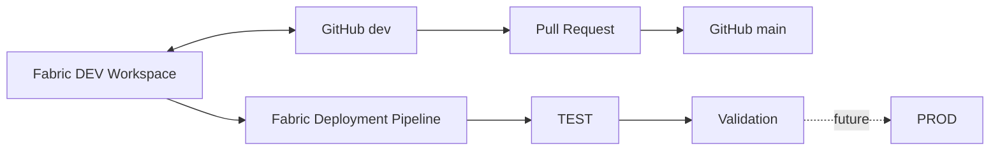
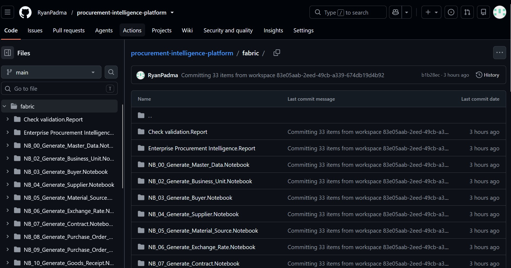
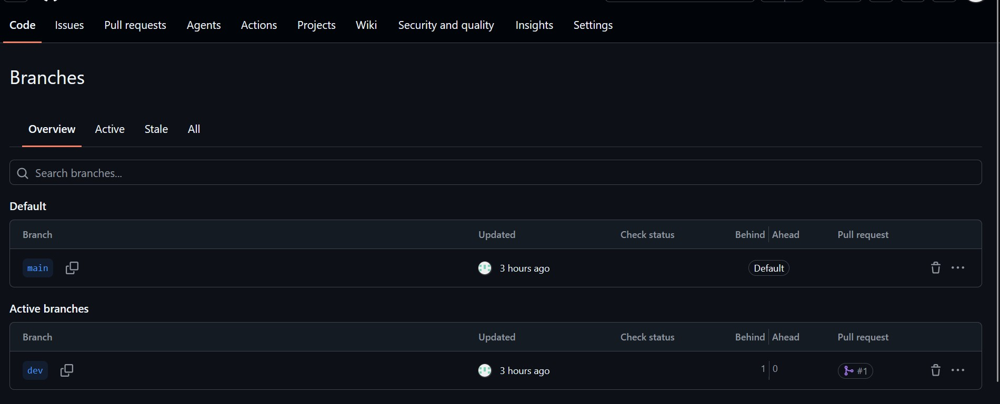
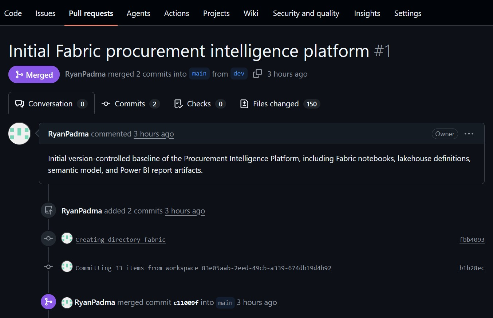
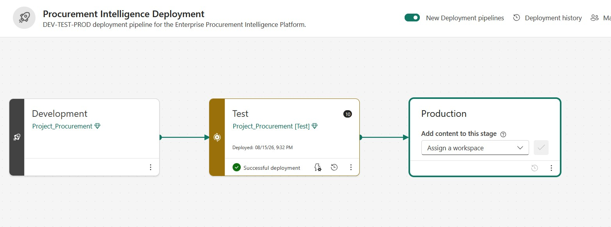
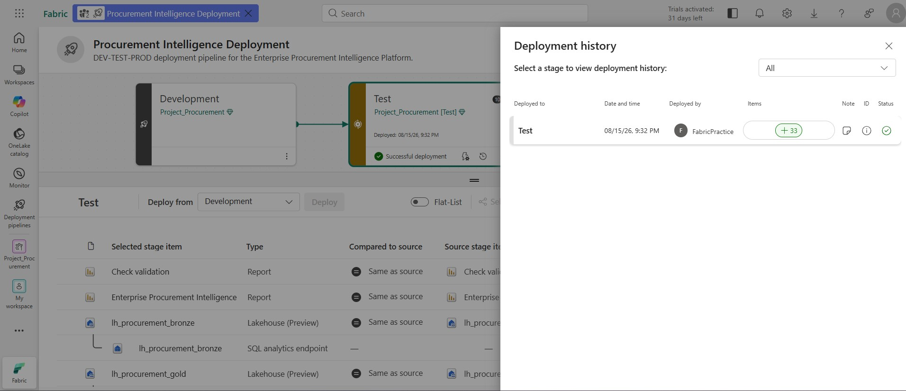

# CI/CD and Deployment

This project uses **GitHub source control** and **Microsoft Fabric Deployment Pipelines** to demonstrate a controlled analytics development lifecycle.

> **Portfolio scope:** The implementation validates source control, pull-request promotion, Fabric Git integration, and DEV → TEST artifact deployment. Full TEST/PROD data initialization and Production promotion are documented as productionization extensions.

---

## 1. Implemented Lifecycle



Two mechanisms are intentionally separated:

- **GitHub** controls versions, branches, and review.
- **Fabric Deployment Pipelines** promote supported workspace artifacts between environments.

---

## 2. Fabric Git Integration

The Development workspace is connected directly to the GitHub repository and the `dev` branch.


The connection uses:

```text
Repository: procurement-intelligence-platform
Git folder: /fabric
Branch: dev
```

Fabric-generated item definitions are therefore version controlled under `/fabric`, while Databricks notebooks and project documentation are maintained separately in the repository.

The synchronized repository contains Fabric notebooks, Lakehouse definitions, semantic-model artifacts, and Power BI report artifacts.



---

## 3. Branch and Pull-Request Workflow

The repository uses a simple two-branch strategy:

| Branch | Role |
|---|---|
| `dev` | Active Fabric development |
| `main` | Reviewed stable baseline |



Changes are promoted through a pull request rather than committed directly from development into the stable baseline.

The initial platform baseline was successfully merged from `dev` into `main`.



The initial PR included the version-controlled Fabric platform baseline, including notebooks, Lakehouse definitions, the semantic model, and report artifacts.

This establishes the development pattern:

```text
Develop in Fabric DEV
        ↓
Synchronize to GitHub dev
        ↓
Review through Pull Request
        ↓
Merge into main
```

---

## 4. Fabric Deployment Pipeline

A three-stage Fabric deployment pipeline is configured:

```text
Development → Test → Production
```



The **Development → Test** promotion has been executed successfully.

The deployment history confirms a successful Test deployment containing **33 Fabric items**.



After deployment, TEST notebook dependencies were rebound to TEST workspace artifacts and the deployed environment was validated.

The Production stage is intentionally retained as the next promotion stage rather than being presented as already completed.

---

## 5. Artifact Deployment Is Not Data Deployment

A critical Fabric behavior is that deployment pipelines promote **artifact definitions**, not physical Delta Lake table data.

Therefore:

```text
DEV analytical artifacts
        ↓
Fabric Deployment Pipeline
        ↓
TEST analytical artifacts

DEV Delta data
        ✕
not automatically copied to TEST
```

A production implementation would combine artifact deployment with environment-specific data initialization:

```text
Artifact Deployment
        ↓
Target Environment Initialization
        ↓
Pipeline / Notebook Orchestration
        ↓
Data Quality Validation
        ↓
Release Approval
        ↓
Production Promotion
```

For this portfolio, reproducing the complete synthetic dataset in every environment would add infrastructure volume without materially improving the CI/CD demonstration.

---

## 6. Validation and Release Control

Deployment is not treated as complete merely because Fabric reports a successful artifact copy.

The intended release pattern is:

```text
Deploy
  ↓
Resolve target-environment dependencies
  ↓
Initialize / process required data
  ↓
Run validation
  ↓
Approve next-stage promotion
```

The wider platform includes reconciliation, referential-integrity, grain, and ML-output controls.

In the validated DEV analytical environment, the final Fabric-side ML validation completed:

**64 rules → 64 PASS → 0 FAIL**

A production implementation would automate these checks as formal CI/CD release gates.

---

## 7. What the Portfolio Demonstrates

### Implemented

- Fabric workspace connected to GitHub
- `/fabric` managed through native Fabric Git integration
- `dev` development branch
- `main` stable baseline
- pull-request based promotion
- successful initial PR merge
- three-stage DEV → TEST → PROD pipeline
- successful **33-item DEV → TEST deployment**
- deployment-history evidence
- TEST dependency rebinding and validation
- separation of artifact deployment from physical environment data

### Production extensions

- automated target-environment initialization
- environment-specific configuration and secrets
- automated CI quality gates
- full TEST and PROD data orchestration
- formal release approvals
- rollback procedures
- deployment monitoring and alerting
- completed Production promotion

---

## 8. Design Summary

| Area | Implementation |
|---|---|
| Source control | GitHub |
| Fabric Git branch | `dev` |
| Stable branch | `main` |
| Review mechanism | Pull Request |
| Fabric repository path | `/fabric` |
| Environment pipeline | DEV → TEST → PROD |
| Validated promotion | DEV → TEST |
| Items in validated TEST deployment | **33** |
| Environment data | Initialized separately |
| Release principle | Deploy → initialize → validate → approve |

---

## Related Documentation

- `README.md` — project overview
- `docs/architecture/architecture.md` — solution architecture
- `docs/data-quality.md` — validation framework
- `docs/ml/ml-pipeline.md` — Databricks-to-Fabric ML lifecycle
