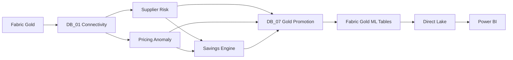

# ML Pipeline and Fabric Integration

This document summarizes how the Databricks ML workflows connect to Microsoft Fabric and how validated outputs are promoted back into the governed Gold layer.

---

## 1. End-to-End Flow



The core design principle is simple:

> Databricks develops and scores the analytics; Fabric Gold remains the governed consumption layer.

Power BI therefore does not depend directly on intermediate model-development datasets.

---

## 2. Secure Fabric ↔ Databricks Connectivity

`DB_01_Setup_and_Read_Gold` validates the cross-platform connection.

The notebook demonstrates:

- Azure Key Vault credential retrieval
- service-principal authentication
- OneLake OAuth configuration
- Fabric Gold → Databricks reads
- Databricks → Fabric write-back

The connectivity test successfully read Fabric Gold data and completed a write-back validation.

---

## 3. Notebook Sequence

```text
DB_01  Setup and read Fabric Gold
DB_02  Supplier-risk feature engineering
DB_03  Train and score supplier-risk model
DB_04  Pricing-anomaly feature engineering
DB_05  Train and score Isolation Forest
DB_06  Build Savings Opportunity Engine
DB_07  Validate and promote ML outputs to Fabric Gold
```

This separates:

- connectivity
- feature engineering
- model development
- prescriptive analytics
- governed output promotion

---

## 4. MLflow Role

MLflow is used across the Databricks workflows for experiment and run management.

It tracks:

- supplier-risk candidate models
- temporal-test and production supplier-risk models
- pricing-anomaly diagnostic and production models
- Savings Opportunity Engine execution

This provides model/run lineage without requiring Power BI to consume MLflow artifacts directly.

---

## 5. Gold Promotion

`DB_07_Score_and_Write_ML_Outputs` promotes three validated products:

| Gold table | Grain | Rows in validated snapshot |
|---|---|---:|
| `ml_supplier_risk_prediction` | Supplier prediction snapshot | **356** |
| `ml_pricing_anomaly_prediction` | PO item | **21,752** |
| `ml_savings_opportunity` | Supplier × Category | **983** |

DB_07 maps Databricks business keys to Gold surrogate keys before writing.

Reference validation included:

- 500 valid supplier SCD2 records on the prediction date
- 20 category mappings
- 75,994 PO-item mappings
- zero duplicate key mappings

Prediction DateKey:

```text
20260731
```

---

## 6. Pre-Write Validation

Before any Gold write, DB_07 validates:

### Supplier Risk

- row count preserved
- unique grain
- complete SupplierKey coverage
- valid scores
- valid classifications

### Pricing Anomaly

- row count preserved
- unique PO-item grain
- complete PurchaseOrderFactKey coverage
- complete dimensional coverage
- valid anomaly scores and flags

### Savings Opportunity

- row count preserved
- unique supplier-category grain
- complete dimensional coverage
- non-negative savings
- valid priority scores
- valid ranks

Cross-product checks also confirm that every savings supplier has a supplier-risk prediction.

---

## 7. Post-Write Reconciliation

After persistence, DB_07 reloads the physical Gold tables and reconciles them to the validated Databricks outputs.

Persisted snapshots:

```text
Supplier Risk:       356
Pricing Anomaly:  21,752
Savings Opportunity: 983
```

Reconciliation result:

| Check | Difference |
|---|---:|
| High-risk supplier classification | **0** |
| Pricing anomaly classification | **0** |
| Potential Annual Savings | **€0.00** |

The persistence quality gate passed.

---

## 8. Monitoring Output

DB_07 also persists:

```text
monitoring_ml_gold_promotion_results
```

This creates evidence that the ML promotion itself was validated rather than relying only on successful notebook execution.

The physical Gold ML portfolio therefore contains:

1. `ml_supplier_risk_prediction`
2. `ml_pricing_anomaly_prediction`
3. `ml_savings_opportunity`
4. `monitoring_ml_gold_promotion_results`

---

## 9. Why This Pattern

The architecture separates model development from enterprise consumption:

```text
Databricks
Feature engineering / modeling / MLflow
                ↓
Validated analytical outputs
                ↓
Fabric Gold
Keys / lineage / reconciliation
                ↓
Direct Lake semantic model
                ↓
Power BI
```

This provides:

- stable analytical grains
- governed Gold keys
- reconciliation controls
- clear lineage
- simpler semantic-model integration

---

## Related Documentation

- `supplier-risk.md`
- `pricing-anomaly.md`
- `savings-opportunity.md`
- `docs/architecture/architecture.md`
- `docs/architecture/data-model.md`
- `docs/data-quality.md`
