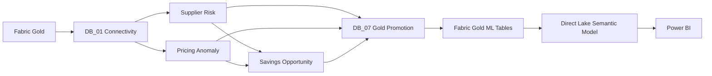
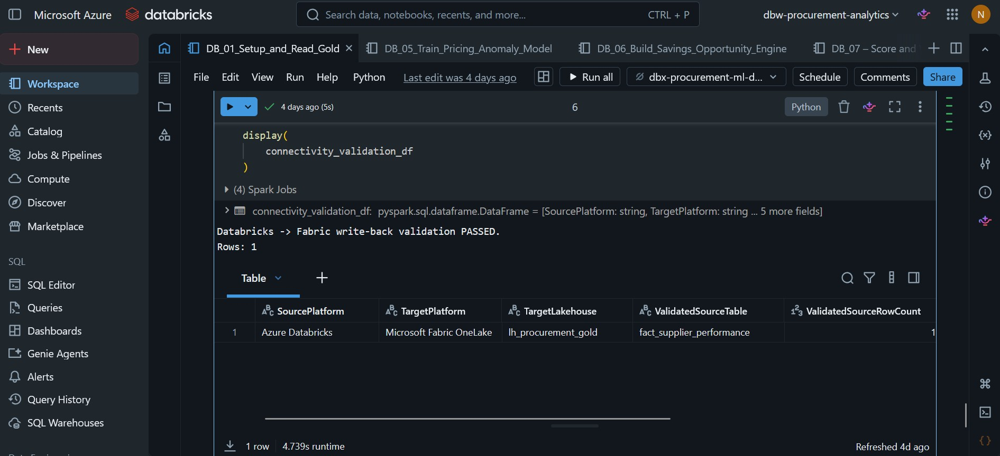

# Enterprise Procurement Intelligence Platform
## ML Pipeline & Fabric Integration

This document explains how the Azure Databricks ML layer connects to Microsoft Fabric, how models and analytical engines are executed, and how validated outputs are promoted back into Fabric Gold for Direct Lake and Power BI consumption.

> **Portfolio note:** The project uses synthetic procurement data. ML outputs demonstrate the engineering workflow and are not production forecasts or realized business outcomes.

---

## 1. End-to-End ML Flow



The key architectural principle is:

> **Databricks develops and scores the analytics; Fabric Gold remains the governed consumption layer.**

Power BI therefore does not depend directly on Databricks development tables or MLflow artifacts.

---

## 2. Notebook Sequence

The Databricks workflow is organized into seven notebooks.

| Notebook | Purpose |
|---|---|
| `DB_01` | Secure Fabric Gold access and OneLake write-back validation |
| `DB_02` | Supplier-risk feature engineering |
| `DB_03` | Supplier-risk model training, validation, and scoring |
| `DB_04` | Pricing-anomaly feature engineering |
| `DB_05` | Isolation Forest training, diagnostics, and scoring |
| `DB_06` | Savings Opportunity Engine |
| `DB_07` | Validate and promote ML outputs into Fabric Gold |

This separates:

- connectivity
- feature engineering
- model development
- scoring
- prescriptive analytics
- governed output promotion

---

# 3. Secure Fabric ↔ Databricks Connectivity

`DB_01_Setup_and_Read_Gold` establishes the cross-platform connection.

The notebook demonstrates:

- Azure Key Vault / Databricks secret retrieval
- service-principal authentication
- OneLake OAuth configuration
- Fabric Gold → Databricks reads
- Databricks → Fabric write-back validation

Environment-specific Fabric identifiers are parameterized rather than embedded as public credentials.

<!-- SCREENSHOT: docs/screenshots/ml/01-onelake-secure-connectivity.jpg -->


*DB_01 evidence confirming successful Databricks → Microsoft Fabric OneLake write-back validation.*

This validates the technical path required for both reading governed Gold data and returning ML outputs to Fabric.

---

# 4. Supplier Risk Workflow

The supplier-risk workflow uses:

```text
Fabric Gold
    ↓
DB_02 Supplier-Level Feature Engineering
    ↓
DB_03 Model Development
    ↓
Temporal Validation
    ↓
2026 Supplier Scoring
```

Key engineering controls include:

- future-looking target construction
- removal of future outcome fields before training
- grouped cross-validation by supplier
- untouched temporal test period
- comparison of multiple model families
- MLflow experiment tracking
- final scoring after model selection

Validated scoring population:

- **356 suppliers**
- **204 high-risk suppliers**

For the full modeling details, see [Supplier Risk Modeling](supplier-risk.md).

---

# 5. Pricing Anomaly Workflow

The pricing workflow operates at PO-item grain.

```text
Fabric Gold PO Items
        ↓
DB_04 Leakage-Safe Price Features
        ↓
DB_05 Isolation Forest
        ↓
Temporal Diagnostics
        ↓
2026 Production Scoring
```

Historical benchmarks exclude the current PO item's own price so the model does not leak current information into its benchmark.

Validated 2026 scoring result:

- **21,752** PO items scored
- **1,216** pricing anomalies
- **5.59%** anomaly rate

For the full model design and temporal diagnostics, see [Pricing Anomaly Detection](pricing-anomaly.md).

---

# 6. Savings Opportunity Workflow

`DB_06_Build_Savings_Opportunity_Engine` combines ML and procurement signals into a prescriptive supplier-category decision layer.

Inputs include:

- pricing anomaly evidence
- contract / historical price benchmarks
- maverick-spend leakage
- supplier risk
- annualized eligible spend
- negotiation potential

Output grain:

```text
Supplier × Category × Prediction Date
```

Validated portfolio result:

- **983** supplier-category opportunities
- **955** positive opportunities
- **471** actionable opportunities
- **€97.55M** modeled potential annual savings

The engine is tracked through MLflow and includes an explicit quality gate before promotion.

For the detailed logic, see [Savings Opportunity Engine](savings-opportunity.md).

---

# 7. MLflow Lifecycle

MLflow is used as the model/run-management layer across the Databricks workflow.

It tracks:

- supplier-risk candidate models
- supplier-risk temporal-test runs
- supplier-risk production candidate
- pricing-anomaly diagnostic runs
- pricing-anomaly production model
- Savings Opportunity Engine execution

MLflow therefore provides:

- experiment lineage
- model/run comparison
- reproducibility evidence
- model metadata

Power BI does not consume MLflow directly. Only validated analytical outputs are promoted into Fabric Gold.

---

# 8. Gold Promotion

`DB_07_Score_and_Write_ML_Outputs` is the control point between Databricks model development and Fabric analytical consumption.

Three products are promoted:

| Fabric Gold table | Grain | Validated rows |
|---|---|---:|
| `ml_supplier_risk_prediction` | Supplier × Prediction Date | **356** |
| `ml_pricing_anomaly_prediction` | PO Item × Prediction Date | **21,752** |
| `ml_savings_opportunity` | Supplier × Category × Prediction Date | **983** |

DB_07 maps Databricks business keys to Fabric Gold surrogate keys before persistence.

Reference validation includes:

- supplier SCD2 mapping
- category mapping
- purchase-order fact mapping
- dimensional-key completeness
- prediction-date mapping
- duplicate-key checks

---

## 9. Pre-Write Validation

Before physical Gold persistence, DB_07 validates each output.

### Supplier Risk

- source row count preserved
- unique supplier prediction grain
- complete SupplierKey coverage
- valid risk scores
- valid risk classifications

### Pricing Anomaly

- source row count preserved
- unique PO-item grain
- complete PurchaseOrderFactKey coverage
- complete dimensional coverage
- valid anomaly scores and flags

### Savings Opportunity

- source row count preserved
- unique supplier-category grain
- complete dimensional coverage
- non-negative savings
- valid priority scores
- valid ranks

Cross-product checks also confirm that savings-opportunity suppliers have matching supplier-risk predictions.

---

# 10. Physical Fabric Gold Promotion

<!-- SCREENSHOT: docs/screenshots/ml/07-ml-output-promotion-validation.jpg -->


*DB_07 evidence showing the three validated ML products promoted into physical Fabric Gold tables.*

The persisted Gold layer contains:

```text
ml_supplier_risk_prediction
ml_pricing_anomaly_prediction
ml_savings_opportunity
monitoring_ml_gold_promotion_results
```

The monitoring table retains validation evidence for the promotion process.

---

# 11. Post-Write Reconciliation

After persistence, DB_07 reloads the physical Gold tables and reconciles them with the validated Databricks outputs.

Validated persisted row counts:

```text
Supplier Risk:          356
Pricing Anomaly:     21,752
Savings Opportunity:    983
```

Reconciliation result:

| Check | Difference |
|---|---:|
| High-risk supplier classification | **0** |
| Pricing anomaly classification | **0** |
| Potential Annual Savings | **€0.00** |

The persistence quality gate passed.

This ensures the values consumed by Direct Lake are the same validated outputs produced by Databricks.

---

# 12. Fabric-Side Final Validation

After Gold promotion, Fabric performs a final consolidated validation.


*NB_40 evidence confirming the three promoted ML products and the consolidated validation result.*

Final DEV validation result:

**64 validation rules → 64 PASS → 0 FAIL**

The same output confirms:

- 356 supplier-risk predictions
- 21,752 pricing-anomaly predictions
- 983 savings opportunities
- 955 positive opportunities
- 471 actionable opportunities
- €97.55M modeled potential annual savings

This provides a second validation boundary after the Databricks-side quality gates.

---

# 13. Semantic-Model Integration

Once validated, the three ML products become governed Gold analytical tables.

<!-- SCREENSHOT: docs/screenshots/fabric/04-ml-semantic-model-extension.jpg -->


*Semantic-model evidence showing supplier-risk, pricing-anomaly, and savings-opportunity outputs connected to shared Gold dimensions.*

This allows Power BI to evaluate ML outputs together with:

- supplier context
- category
- material
- contract
- date
- procurement spend
- supplier performance
- savings execution

The ML tables remain separate because their prediction grains differ from operational fact grains.

---

# 14. Why This Architecture

The design separates three concerns:

```text
Databricks
Feature engineering / modeling / MLflow
                ↓
Validated analytical products
                ↓
Fabric Gold
Governed keys / reconciliation / lineage
                ↓
Direct Lake
Semantic relationships / DAX
                ↓
Power BI
Business decision support
```

This provides:

- stable analytical grains
- governed Gold surrogate keys
- cross-platform reconciliation
- clear lineage
- reusable semantic-model integration
- no direct dependency between Power BI and model-development tables

---

# 15. Implemented vs. Production Extensions

### Implemented

- secure OneLake connectivity
- Fabric Gold → Databricks reads
- Databricks → Fabric write-back
- supplier-risk feature engineering and modeling
- pricing anomaly feature engineering and Isolation Forest
- Savings Opportunity Engine
- MLflow experiment tracking
- DB_07 pre-write validation
- Gold surrogate-key mapping
- physical ML Gold persistence
- post-write reconciliation
- monitoring output persistence
- final Fabric validation
- Direct Lake semantic-model integration

### Production extensions

A production ML platform would additionally require:

- automated retraining orchestration
- formal model approval workflow
- drift monitoring
- feature-drift monitoring
- performance monitoring
- environment-specific model promotion
- automated rollback
- alerting
- model-governance ownership

These items are documented as future productionization rather than represented as completed portfolio functionality.

---

## Related Documentation

- [Main README](../../README.md)
- [Technical Architecture](../architecture/architecture.md)
- [Data Model](../architecture/data-model.md)
- [Data Quality & Validation](../data-quality.md)
- [Supplier Risk Modeling](supplier-risk.md)
- [Pricing Anomaly Detection](pricing-anomaly.md)
- [Savings Opportunity Engine](savings-opportunity.md)
- [Power BI Report Guide](../../power-bi/report-guide.md)
