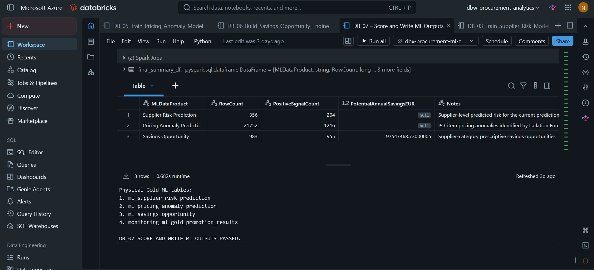

# Pricing Anomaly Detection

This document explains the pricing-anomaly workflow implemented in **Azure Databricks** and how unusual purchasing-price behavior is scored, validated, and promoted into Microsoft Fabric Gold.

> **Portfolio note:** The model uses synthetic procurement data. Anomalies identify unusual pricing patterns for review; they do not automatically represent confirmed overcharges or realized savings.

---

## 1. Objective

The model identifies PO items whose purchasing prices behave unusually relative to historical and governed pricing context.

```text
PO-Item Pricing History
        ↓
Leakage-Safe Historical Benchmarks
        ↓
Isolation Forest
        ↓
Anomaly Score & Flag
        ↓
Fabric Gold
        ↓
Direct Lake → Power BI
```

The objective is to help procurement prioritize transactions for investigation based on unusual pricing behavior and meaningful spend exposure.

---

## 2. Leakage-Safe Feature Engineering

`DB_04_Pricing_Anomaly_Feature_Engineering` operates at **PO-item grain**.

The central engineering rule is:

> **The current PO item's price never contributes to its own historical benchmark.**

Historical benchmarks therefore use only transactions available before the item being evaluated.

Benchmark levels include:

- same material
- same supplier + material
- category

Governed contract-price information is also included when available.

The PO-item grain was validated across:

**75,994 eligible historical and current records**

This ensures anomaly scoring is built on a controlled transaction population rather than on duplicated or mixed-grain records.

---

## 3. Feature Contract

The Isolation Forest uses **19 numeric features** covering:

- price-to-history ratios
- percentage deviations
- historical price z-scores
- supplier-material price variability
- category-level price behavior
- governed contract-price variance
- log unit price
- log quantity
- historical benchmark availability

Examples include:

```text
MaterialPriceZScore
SupplierMaterialPriceZScore
CategoryPriceZScore
AbsoluteContractPriceVariancePct
SupplierMaterialHistoricalCVPct
BenchmarkCoverageCount
```

A rule-based extreme-price flag is retained only as a **diagnostic proxy**.

It is **not used as a training target**.

This distinction matters because the model remains unsupervised while still being evaluated against independent pricing signals.

---

## 4. Temporal Design

The historical feature store contains:

**54,023 rows through 2025**

The workflow uses a deliberate temporal split:

```text
2023–2024 → Model Development
2025      → Untouched Temporal Diagnostic
2023–2025 → Final Production Training
2026      → Production Scoring
```

| Population | Rows |
|---|---:|
| Development, 2023–2024 | **22,569** |
| 2025 temporal diagnostic | **18,940** |
| Production training, 2023–2025 | **41,509** |
| 2026 scoring | **21,752** |

All **21,752** 2026 pricing rows were model-eligible.

This separation prevents the 2025 diagnostic period from influencing model-development decisions.

---

## 5. Isolation Forest

Isolation Forest is used because the problem is naturally **unsupervised**: confirmed anomaly labels are not available.

The modeling pipeline applies median imputation before Isolation Forest scoring.

During development:

- a **5% review rate** is used to establish the anomaly threshold
- the raw model output is converted into a normalized **0–100 anomaly score**
- the governed anomaly threshold is persisted downstream rather than relying directly on the default Isolation Forest label

This produces a business-friendly score while preserving the unsupervised modeling approach.

---

## 6. 2025 Temporal Diagnostic

The untouched 2025 population is used to test whether the unsupervised ranking aligns with independent pricing signals.

### Extreme-price proxy diagnostic

| Metric | Result |
|---|---:|
| Predicted anomaly rate | **5.79%** |
| Extreme-price proxy prevalence | **8.40%** |
| ROC-AUC vs. proxy | **0.7958** |
| PR-AUC vs. proxy | **0.2857** |
| Precision vs. proxy | **35.64%** |
| Recall vs. proxy | **24.58%** |
| Precision lift vs. proxy baseline | **4.24×** |

### Governed contract-price diagnostic

| Metric | Result |
|---|---:|
| Overall contract-price exception rate | **1.38%** |
| Exception rate among anomalies | **11.03%** |
| Enrichment lift | **7.97×** |

These proxies are **validation aids**, not ground-truth anomaly labels.

The important conclusion is that the anomaly ranking shows meaningful enrichment against independent pricing signals, while still being presented honestly as an unsupervised detection model.

---

## 7. Production Scoring

After temporal diagnostics, the final model is retrained on:

**41,509 rows from 2023–2025**

It then scores the 2026 population.

Validated result:

| Metric | Result |
|---|---:|
| PO items scored | **21,752** |
| Pricing anomalies | **1,216** |
| Anomaly rate | **5.59%** |

<!-- SCREENSHOT: docs/screenshots/ml/05-pricing-anomaly-results.jpg -->


*DB_05 production-scoring evidence confirming 21,752 PO items scored, 1,216 pricing anomalies, and a 5.59% anomaly rate.*

The output is persisted as:

```text
ml_pricing_anomaly_prediction
```

at:

```text
PO Item × Prediction Date
```

grain.

---

## 8. Fabric Gold Promotion

Pricing-anomaly results are not consumed directly from Databricks by Power BI.

They are validated and promoted into Fabric Gold through DB_07.

Checks include:

- source row-count reconciliation
- unique PO-item prediction grain
- PurchaseOrderFactKey completeness
- dimensional-key completeness
- valid anomaly-score range
- valid anomaly classification

<!-- SCREENSHOT: docs/screenshots/ml/07-ml-output-promotion-validation.jpg -->


*DB_07 evidence showing the pricing-anomaly output promoted together with the other validated ML data products into physical Fabric Gold tables.*

Validated Gold result:

| Check | Result |
|---|---:|
| Pricing rows written | **21,752** |
| Duplicate grain | **0** |
| Missing PurchaseOrderFactKey | **0** |
| Missing dimensional keys | **0** |
| Invalid anomaly scores | **0** |

Post-write pricing-anomaly classification reconciliation difference:

**0**

---

## 9. Semantic-Model Consumption

The pricing-anomaly output remains at PO-item prediction grain.

```text
fact_purchase_order
        +
ml_pricing_anomaly_prediction
        ↓
Supplier / Material / Category / Contract Context
```

This allows the Direct Lake semantic model to evaluate anomaly scores together with:

- eligible spend
- supplier
- material
- category
- business unit
- contract context
- pricing exposure

The model output therefore becomes useful as a governed analytical signal rather than as an isolated ML result.

---

## 10. Business Use

An anomaly is not treated as proof of savings or overpayment.

Instead:

```text
Pricing Anomaly
      +
Spend Exposure
      +
Supplier / Material / Category Context
      +
Contract Pricing Evidence
      ↓
Procurement Review
```

Examples of appropriate use include:

- prioritizing PO items for commercial review
- identifying supplier/material combinations with unusual pricing
- comparing anomaly exposure across categories
- supporting contract-price investigation
- feeding the downstream Savings Opportunity Engine

The model supports **investigation and prioritization**, not automated commercial conclusions.

---

## 11. Relationship to Savings Opportunity

Pricing anomaly is one input into the prescriptive savings layer.

```text
Pricing Signal
      +
Maverick Spend
      +
Supplier Risk
      +
Eligible Spend
      ↓
Savings Opportunity Engine
```

The pricing signal is therefore separated from the savings calculation itself.

An anomaly may indicate unusual pricing without necessarily producing a modeled savings opportunity.

For the downstream logic, see [Savings Opportunity Engine](savings-opportunity.md).

---

## 12. Key Engineering Controls

The workflow demonstrates:

- explicit PO-item analytical grain
- exclusion of the current transaction from its own benchmark
- leakage-safe historical windows
- modeled historical benchmark coverage
- diagnostic proxy kept separate from training
- untouched 2025 temporal diagnostic
- production training only after temporal evaluation
- normalized anomaly-score output
- governed anomaly threshold
- MLflow tracking of diagnostic and production runs
- Gold key and grain validation
- Databricks-to-Fabric reconciliation

---

## 13. Implemented vs. Production Extensions

### Implemented

- leakage-safe historical benchmark engineering
- PO-item feature store
- 19-feature Isolation Forest contract
- temporal diagnostic design
- proxy-based independent validation
- contract-price enrichment diagnostic
- final 2023–2025 production training
- 2026 scoring
- normalized anomaly score
- Fabric Gold promotion
- cross-platform reconciliation
- semantic-model consumption
- downstream savings integration

### Production extensions

A production pricing-anomaly solution would additionally require:

- confirmed investigation outcomes
- analyst feedback loop
- anomaly disposition tracking
- dynamic threshold governance
- alerting
- model drift monitoring
- feature drift monitoring
- retraining policy
- automated case management
- formal commercial review ownership

These are documented as productionization extensions rather than represented as completed portfolio functionality.

---

## Related Notebooks

- `DB_04_Pricing_Anomaly_Feature_Engineering`
- `DB_05_Train_Pricing_Anomaly_Model`
- `DB_07_Score_and_Write_ML_Outputs`

## Related Documentation

- [Main README](../../README.md)
- [Technical Architecture](../architecture/architecture.md)
- [Data Model](../architecture/data-model.md)
- [Data Quality & Validation](../data-quality.md)
- [ML Pipeline & Fabric Integration](ml-pipeline.md)
- [Supplier Risk Modeling](supplier-risk.md)
- [Savings Opportunity Engine](savings-opportunity.md)
- [Power BI Report Guide](../../power-bi/report-guide.md)
