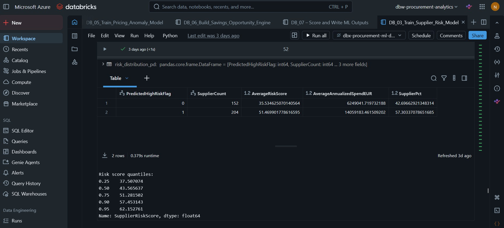

# Supplier Risk Modeling

This document explains the supplier-risk workflow implemented in **Azure Databricks** and how its validated predictions are promoted back into Microsoft Fabric Gold.

> **Portfolio note:** The model uses synthetic data. Results demonstrate the ML engineering process and controls, not production predictive performance.

---

## 1. Objective

The model estimates whether a supplier is likely to experience **high operational risk in the following year**.

The prediction complements historical supplier-performance reporting with a forward-looking signal that can be evaluated alongside:

- procurement spend exposure
- delivery performance
- quality performance
- invoice disputes and exceptions
- supplier context

```text
Historical Supplier Behavior
        ↓
Future-Year Risk Target
        ↓
Feature Engineering
        ↓
Model Comparison & Temporal Validation
        ↓
2026 Supplier Risk Score
        ↓
Fabric Gold → Direct Lake → Power BI
```

The goal is not to use the ML score in isolation, but to support procurement prioritization.

---

## 2. Leakage-Safe Target Design

The target is intentionally **future-looking**.

```text
2022 features → 2023 outcome
2023 features → 2024 outcome
2024 features → 2025 outcome
```

2026 is excluded as a training outcome because it is a partial year.

A supplier receives:

```text
HighRiskNextYearFlag = 1
```

when at least two future adverse conditions occur.

The future-risk conditions use training-population thresholds such as:

- low future OTD: bottom quartile
- high overdue-delivery exposure: top quartile
- high invoice-dispute rate: top quartile
- high invoice-exception rate: top quartile

This prevents the model from learning a same-year risk formula and keeps the prediction objective aligned with the following year's outcome.

---

## 3. Feature Engineering

`DB_02_Supplier_Risk_Feature_Engineering` builds a supplier-year analytical dataset from Fabric Gold.

Feature domains include:

- delivery performance and trends
- invoice disputes and exceptions
- procurement spend
- spend volatility
- maverick-spend behavior
- supplier ESG-style attributes
- synthetic financial-risk attributes
- country and region
- prior-year history availability

Key preparation results:

| Dataset | Result |
|---|---:|
| Supplier-year source rows | **1,869** |
| Labeled training rows | **1,009** |
| 2026 scoring suppliers | **356** |
| Final training columns | **47** |

Future outcome fields are removed before the model-training dataset is persisted.

For 2026 scoring, partial-year spend is annualized using a factor of **1.7217**.

<!-- SCREENSHOT: docs/screenshots/ml/02-supplier-risk-feature-engineering.jpg -->


*DB_02 evidence showing supplier-risk feature profiling and feature-engineering diagnostics in Azure Databricks.*

---

## 4. Model Development

`DB_03_Train_Supplier_Risk_Model` compares three supervised models:

- Logistic Regression
- Random Forest
- Gradient Boosting

The model uses:

- **39 numeric features**
- **5 categorical features**
- median imputation for numeric missing values
- `Unknown` replacement for missing categorical values
- one-hot encoding for categorical features

### Temporal design

```text
2022–2023 → Model Development
2024      → Untouched Temporal Test
2026      → Scoring Population
```

Development uses **5-fold grouped cross-validation by SupplierID** so records from the same supplier are not split carelessly across folds.

Model selection is based on out-of-fold **PR-AUC** rather than accuracy.

---

## 5. Model Selection & MLflow

**Random Forest** produced the strongest development result and was selected.

The operating threshold is optimized separately from the model fit using development predictions.

| Item | Result |
|---|---:|
| Selected model | **Random Forest** |
| Decision threshold | **0.418** |
| Development rows | **664** |
| Temporal test rows | **345** |
| 2026 suppliers scored | **356** |

After temporal testing, the production candidate is retrained using all labeled history from **2022–2024**.

MLflow tracks:

- candidate models
- temporal-test run
- production candidate
- scoring/model metadata

<!-- SCREENSHOT: docs/screenshots/ml/03-mlflow-supplier-risk-experiment.jpg -->


*MLflow evidence showing tracked supplier-risk model-development, temporal-test, and production-candidate runs.*

This demonstrates that model development is managed as an analytical lifecycle rather than as a single isolated notebook experiment.

---

## 6. Temporal Test Result

The untouched 2024 period provides the most realistic view of model performance.

| Metric | 2024 result |
|---|---:|
| High-risk prevalence | **27.83%** |
| ROC-AUC | **0.5494** |
| PR-AUC | **0.3588** |
| PR baseline | **0.2783** |
| Precision | **0.3007** |
| Recall | **0.4792** |
| F1 | **0.3695** |

Confusion matrix:

```text
TN 142   FP 107
FN  50   TP  46
```

### Interpretation

The model ranks risk better than the prevalence baseline, but predictive strength is limited.

The original BRD precision target of **85% was not met**.

That limitation is intentionally retained in the portfolio rather than hidden.

The supplier-risk model is therefore positioned as:

> **an experimental portfolio baseline, not a production-ready risk classifier**

This is important because the portfolio demonstrates proper temporal testing and transparent evaluation rather than only reporting favorable development metrics.

---

## 7. 2026 Production Scoring

The final production candidate scores **356 suppliers**.

The output includes:

- Supplier Risk Score on a 0–100 scale
- high-risk classification
- prediction date
- supplier reference
- model lineage fields

<!-- SCREENSHOT: docs/screenshots/ml/04-supplier-risk-model-evaluation.jpg -->


*2026 supplier-scoring evidence showing the predicted risk distribution and supplier risk-score diagnostics.*

Validated scoring result:

- **356** suppliers scored
- **204** classified as high risk

The scoring output is promoted into:

```text
ml_supplier_risk_prediction
```

---

## 8. Fabric Gold Validation

The supplier-risk predictions are validated before semantic-model consumption.

Checks include:

- duplicate prediction grain
- missing SupplierKey
- invalid risk-score range
- invalid high-risk flag
- source-to-Gold row-count reconciliation

Validated Gold result:

| Check | Result |
|---|---:|
| Supplier predictions written | **356** |
| High-risk suppliers | **204** |
| Duplicate prediction grain | **0** |
| Missing SupplierKey | **0** |
| Invalid risk scores | **0** |
| Invalid risk flags | **0** |

The complete promotion process is documented in [ML Pipeline & Fabric Integration](ml-pipeline.md).

---

## 9. Semantic-Model Consumption

Supplier risk remains separate from operational supplier performance.

```text
fact_supplier_performance
        ≠
ml_supplier_risk_prediction
```

The reason is grain:

```text
Operational Supplier Performance
→ historical performance period

Supplier Risk Prediction
→ supplier × prediction snapshot
```

The Direct Lake semantic model can therefore compare the latest risk prediction with historical performance without forcing the two concepts into the same fact structure.

---

## 10. Business Use

The model becomes useful when the prediction is combined with business exposure.

```text
Supplier Risk Score
        +
Eligible Spend
        +
Delivery Performance
        +
Quality Performance
        ↓
Supplier Prioritization
```

For example, procurement can distinguish between:

- a high-risk supplier with limited spend exposure
- a high-risk supplier supporting a large portion of procurement spend

The output is therefore designed to support **prioritization and investigation**, not automated supplier decisions.

---

## 11. Key Engineering Controls

The workflow demonstrates several controls that are more important than the algorithm itself:

- future outcomes are separated from current-year features
- 2026 partial-year outcomes are excluded from training
- future outcome columns are removed before model fitting
- suppliers are grouped during cross-validation
- 2024 remains untouched until final temporal evaluation
- missing values are handled inside the preprocessing pipeline
- multiple candidate models are compared
- the decision threshold is optimized separately
- MLflow tracks experiments and production candidates
- Gold promotion validates keys, grain, score range, and classification
- weak temporal-test performance is reported transparently

---

## 12. Implemented vs. Production Extensions

### Implemented

- future-looking risk-target construction
- supplier-level feature engineering
- grouped cross-validation
- model comparison
- Random Forest baseline
- temporal holdout evaluation
- threshold selection
- MLflow tracking
- 2026 scoring
- Fabric Gold promotion
- semantic-model consumption
- Gold validation

### Production extensions

A production supplier-risk model would additionally require:

- stronger business-defined target governance
- larger and more representative historical data
- model explainability standards
- threshold governance
- drift monitoring
- performance monitoring
- model approval workflow
- retraining policy
- operational alerting
- formal business ownership of risk classifications

These are documented as future productionization rather than represented as completed functionality.

---

## Related Notebooks

- `DB_02_Supplier_Risk_Feature_Engineering`
- `DB_03_Train_Supplier_Risk_Model`
- `DB_07_Score_and_Write_ML_Outputs`

## Related Documentation

- [Main README](../../README.md)
- [Technical Architecture](../architecture/architecture.md)
- [Data Model](../architecture/data-model.md)
- [Data Quality & Validation](../data-quality.md)
- [ML Pipeline & Fabric Integration](ml-pipeline.md)
- [Power BI Report Guide](../../power-bi/report-guide.md)
