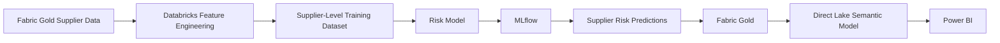

# Enterprise Procurement Intelligence Platform
## Supplier Risk Modeling

This document summarizes the supplier-risk modeling component of the procurement analytics platform.

> **Portfolio note:** The model uses synthetic data and is intended to demonstrate an end-to-end ML workflow. It should not be interpreted as a production supplier-risk model or a claim of real-world predictive performance.

---

## 1. Objective

The supplier-risk model is designed to identify suppliers that may require additional procurement attention.

The model converts historical supplier behavior and contextual attributes into a supplier-level risk prediction that can be consumed alongside:

- procurement spend
- delivery performance
- quality performance
- invoice disputes
- supplier attributes

The goal is not to treat ML output as a standalone score, but to connect it to procurement decision-making.

---

## 2. Analytical Flow



The workflow separates model development from governed business consumption.

---

## 3. Modeling Grain

The supplier-risk model operates at **supplier level**.

The prediction output is stored as a supplier prediction snapshot rather than being merged into operational supplier-performance facts.

Conceptually:

```text
Supplier
+
Prediction Date
=
Supplier Risk Prediction
```

This distinction is important because:

- supplier performance facts represent operational history
- supplier-risk predictions represent model output at a specific point in time

The two should not be modeled as the same business event.

---

## 4. Feature Domains

Supplier-level features are engineered in Azure Databricks.

Feature domains include:

### Delivery Performance

Examples:

- late-delivery behavior
- on-time delivery performance
- delivery consistency

### Invoice and Dispute Behavior

Examples:

- invoice-dispute history
- invoice exception behavior

### Spend Behavior

Examples:

- supplier spend
- spend volatility
- procurement exposure

### Supplier Context

Examples:

- country or risk attributes
- synthetic financial indicators
- synthetic ESG-style indicators

The project uses these feature groups to demonstrate how procurement-domain information can be transformed into an ML-ready supplier dataset.

---

## 5. Feature Engineering

Feature engineering is performed in Databricks using Gold procurement data as the analytical source.

Conceptually:

```text
Gold procurement facts
+
Supplier dimension
+
Supplier performance
+
Contextual attributes
        ↓
Supplier-level feature table
```

The objective is to create one consistent analytical record per supplier for model training and scoring.

Feature engineering must preserve the intended supplier grain and avoid duplication caused by joining transactional data directly without aggregation.

---

## 6. Model Approach

The supplier-risk component uses a baseline supervised machine-learning approach.

The project technology stack includes **Random Forest** for this use case.

The purpose of the model is to demonstrate:

- feature engineering
- supervised ML
- experiment tracking
- model evaluation
- prediction generation
- downstream integration

The current model is positioned as an **experimental portfolio baseline**, not a production-optimized risk model.

---

## 7. MLflow

MLflow is used to support the model-development lifecycle.

Its role includes:

- experiment tracking
- model-run comparison
- model-management evidence
- reproducibility of model development

The project therefore demonstrates that model development is managed as an analytical engineering process rather than as an isolated notebook experiment.

---

## 8. Prediction Output

Supplier-risk predictions are promoted back into Fabric Gold.

Target analytical table:

```text
ml_supplier_risk_prediction
```

Typical output fields include:

- supplier key
- prediction date
- risk score or probability
- predicted risk class
- model/version metadata where retained

The exact physical schema is maintained in the implementation artifacts.

---

## 9. Why Predictions Return to Fabric Gold

Power BI does not consume model-development tables directly from Databricks.

The integration pattern is:

```text
Databricks prediction
        ↓
Validation
        ↓
Fabric Gold ML table
        ↓
Direct Lake
        ↓
Power BI
```

This design keeps the reporting layer connected to a governed analytical data product.

It also separates:

- model development
- model output validation
- business consumption

---

## 10. Validation

Supplier-risk outputs are validated before semantic-model consumption.

Typical checks include:

- expected supplier prediction grain
- supplier-key completeness
- duplicate prediction snapshots
- prediction-score range
- valid risk classification
- source-to-output reconciliation
- Databricks-to-Fabric row-count reconciliation

The final Fabric-side ML validation is included in the broader project validation framework.

The validated DEV environment completed:

**64 validation rules → 64 PASS → 0 FAIL**

across the final Fabric-side ML validation process.

---

## 11. Power BI Consumption

Supplier risk is consumed together with operational procurement context.

Relevant Power BI analysis includes:

- high-risk supplier count
- supplier spend exposure
- supplier delivery performance
- supplier quality performance
- supplier-level risk prioritization

This is important because a risk score becomes more useful when procurement can understand both:

```text
How risky is the supplier?
```

and:

```text
How much business exposure do we have to that supplier?
```

---

## 12. Relationship to Supplier Performance

Supplier risk and supplier performance are related but not interchangeable.

### `fact_supplier_performance`

Represents operational supplier performance, such as:

- delivery results
- quality indicators
- historical trends

### `ml_supplier_risk_prediction`

Represents a model prediction snapshot.

Keeping these structures separate prevents analytical grain conflicts and allows historical performance to be compared with predictive risk.

---

## 13. Portfolio Scope

### Implemented

- supplier-level feature engineering in Databricks
- supervised supplier-risk modeling
- Random Forest as the portfolio model family
- MLflow-based experiment/model management
- prediction generation
- validation of output grain and score behavior
- promotion of predictions into Fabric Gold
- Direct Lake consumption
- Power BI supplier-risk reporting

### Production extensions

A production implementation would additionally require:

- formal target definition and governance
- broader feature validation
- production model monitoring
- drift detection
- automated retraining
- model approval workflow
- explainability requirements
- threshold governance
- production alerting
- formal business ownership of risk classifications

These are documented as productionization extensions rather than represented as completed functionality.

---

## 14. Design Summary

| Area | Decision |
|---|---|
| Modeling grain | Supplier prediction snapshot |
| Feature engineering | Azure Databricks |
| Source data | Fabric Gold |
| Model family | Random Forest baseline |
| ML lifecycle | MLflow |
| Output | `ml_supplier_risk_prediction` |
| Consumption | Fabric Gold → Direct Lake → Power BI |
| Validation | Grain, score, key, and reconciliation checks |
| Positioning | Experimental portfolio baseline |

---

## 15. Business Value

The supplier-risk model demonstrates how procurement analytics can move beyond descriptive reporting.

Instead of only showing historical supplier performance, the platform creates a predictive signal that can be evaluated alongside:

- spend exposure
- supplier performance
- operational quality
- procurement concentration

The intended decision pattern is:

```text
Supplier performance
        +
Risk prediction
        +
Spend exposure
        ↓
Procurement prioritization
```

This connects machine learning to a practical procurement-management use case.

---

## Related Documentation

- `README.md` — project overview
- `docs/architecture/architecture.md` — platform architecture
- `docs/architecture/data-model.md` — analytical model
- `docs/data-quality.md` — validation framework
- `docs/ml/pricing-anomaly.md` — pricing anomaly detection
- `docs/ml/savings-opportunity.md` — prescriptive savings analytics
