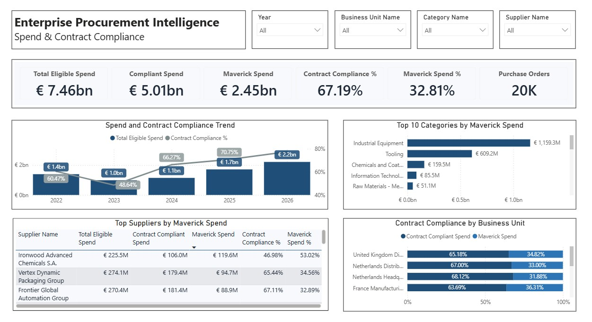
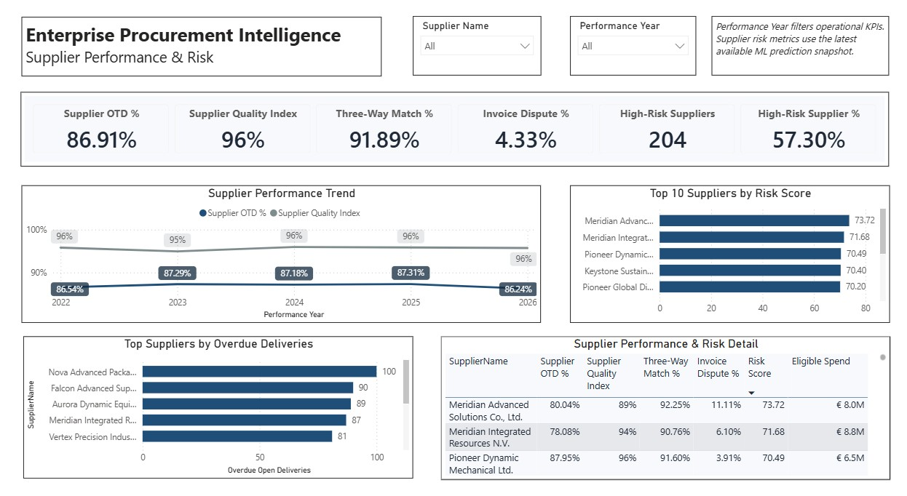
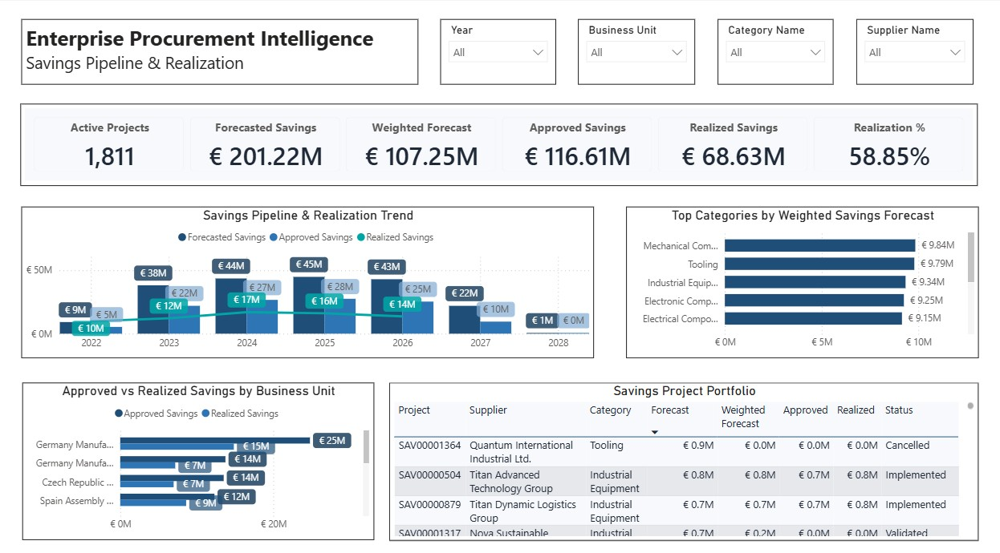
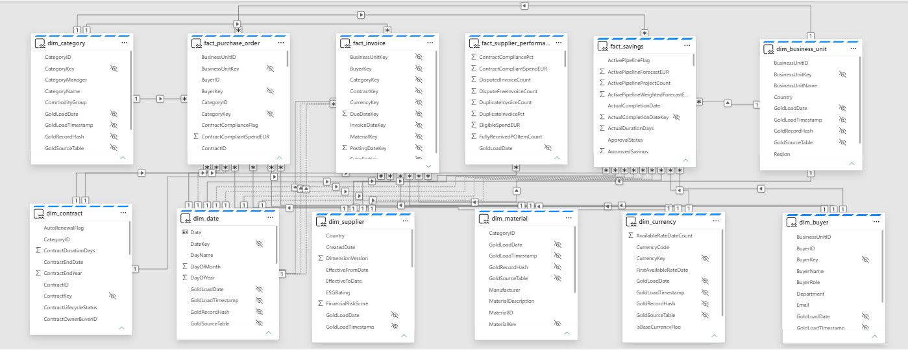
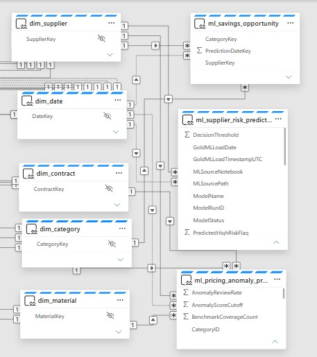

# Power BI Report Guide

The Power BI report is the **decision layer** of the Enterprise Procurement Intelligence Platform. It combines governed procurement KPIs, supplier-performance analytics, ML predictions, and savings intelligence through a **Direct Lake semantic model**.

> **Portfolio note:** All values are generated from synthetic data and are presented only to demonstrate the analytical solution.

---

## 1. Report at a Glance

The report is designed as a decision journey rather than a collection of disconnected dashboards.

```text
Executive Performance
        ↓
Spend Governance
        ↓
Supplier Performance & Risk
        ↓
Pricing & Savings Opportunity
        ↓
Savings Execution & Realization
```

| Page | Primary question |
|---|---|
| Executive Overview | Where does procurement performance require leadership attention? |
| Spend & Contract Compliance | Where is spend leakage and maverick purchasing concentrated? |
| Supplier Performance & Risk | Which suppliers combine weak performance, high risk, and material exposure? |
| Pricing Anomaly & Savings Intelligence | Where do pricing signals indicate investigation or negotiation potential? |
| Savings Pipeline & Realization | How is the savings portfolio progressing from forecast to realization? |

<!-- SCREENSHOT: power-bi/screenshots/01-executive-overview.jpg -->


*Executive landing page combining spend governance, supplier performance, predictive risk, realized savings, and modeled savings opportunity.*

---

# 2. Executive Overview

**Audience:** CPO / Procurement Leadership  
**Purpose:** Provide one management view of spend governance, supplier performance, risk, and savings potential.

<!-- SCREENSHOT: power-bi/screenshots/01-executive-overview.jpg -->


### Headline KPIs

| KPI | Result |
|---|---:|
| Total Eligible Spend | **€7.46B** |
| Contract Compliance | **67.19%** |
| Supplier OTD | **86.91%** |
| Realized Savings | **€68.63M** |
| Potential Annual Savings | **€97.55M** |
| High-Risk Spend | **77.28%** |

### What the page shows

- **Spend and Contract Compliance Trend** combines yearly eligible spend with compliance development.
- **Top 10 Categories by Annual Savings Opportunity** shows where modeled savings potential is concentrated.
- **Supplier Risk Ranking** connects risk score with spend exposure.
- **Year, Business Unit, and Category** filters support management-level slicing.

### Decision supported

> **Where should procurement leadership focus first?**

The page deliberately combines current performance and forward-looking signals instead of separating them into different reporting experiences.

### Modeling behavior

ML risk and opportunity KPIs use the **latest available prediction snapshot**.

Operational KPIs continue to respect their historical date logic.

---

# 3. Spend & Contract Compliance

**Audience:** Procurement Leadership / Category Managers  
**Purpose:** Explain the financial scale and location of off-contract purchasing.

<!-- SCREENSHOT: power-bi/screenshots/02-spend-compliance.jpg -->


### Headline KPIs

| KPI | Result |
|---|---:|
| Total Eligible Spend | **€7.46B** |
| Compliant Spend | **€5.01B** |
| Maverick Spend | **€2.45B** |
| Contract Compliance | **67.19%** |
| Maverick Spend | **32.81%** |
| Purchase Orders | **20K** |

### Analytical flow

```text
Enterprise Compliance Rate
        ↓
Trend Over Time
        ↓
Category Drivers
        ↓
Supplier Drivers
        ↓
Business Unit Comparison
        ↓
Sourcing / Contract Action
```

### Main analytical views

**Spend and Contract Compliance Trend**  
Shows how eligible spend and compliance changed from 2022 through 2026.

**Top Categories by Maverick Spend**  
Identifies categories creating the largest off-contract spend exposure.

**Top Suppliers by Maverick Spend**  
Provides supplier-level detail including:

- eligible spend
- compliant spend
- maverick spend
- compliance %
- maverick spend %

**Contract Compliance by Business Unit**  
Compares compliant and maverick-spend shares across organizational units.

### Decision supported

The page moves from the enterprise compliance rate to the suppliers, categories, and business units creating the leakage.

---

# 4. Supplier Performance & Risk

**Audience:** Supplier Management / Category Managers  
**Purpose:** Combine historical operational performance with predictive supplier risk.

<!-- SCREENSHOT: power-bi/screenshots/03-supplier-performance-risk.jpg -->


### Headline KPIs

| KPI | Result |
|---|---:|
| Supplier OTD | **86.91%** |
| Supplier Quality Index | **96%** |
| Three-Way Match | **91.89%** |
| Invoice Dispute Rate | **4.33%** |
| High-Risk Suppliers | **204** |
| High-Risk Supplier % | **57.30%** |

### Main analytical views

**Supplier Performance Trend**  
Tracks OTD and Supplier Quality Index over time.

**Top 10 Suppliers by Risk Score**  
Surfaces suppliers with the highest latest ML risk scores.

**Top Suppliers by Overdue Deliveries**  
Highlights current operational delivery issues.

**Supplier Performance & Risk Detail**  
Combines:

- Supplier OTD %
- Supplier Quality Index
- Three-Way Match %
- Invoice Dispute %
- Risk Score
- Eligible Spend

### Important filter behavior

`Performance Year` filters operational supplier-performance KPIs.

Supplier-risk measures use the **latest available ML prediction snapshot** rather than treating the prediction as an ordinary historical transaction.

This reflects the data model:

```text
fact_supplier_performance
        ≠
ml_supplier_risk_prediction
```

### Decision supported

> **Which suppliers require attention because weak performance or predicted risk is combined with meaningful procurement exposure?**

This is intentionally an **exposure-based prioritization** view rather than a simple supplier scorecard.

---

# 5. Pricing Anomaly & Savings Intelligence

**Audience:** Strategic Sourcing / Category Managers  
**Purpose:** Turn ML pricing signals into prioritized commercial opportunities.

<!-- SCREENSHOT: power-bi/screenshots/04-pricing-savings-intelligence.jpg -->


### Headline KPIs

| KPI | Result |
|---|---:|
| Pricing Items Scored | **21,752** |
| Pricing Anomalies | **1,216** |
| Pricing Anomaly Rate | **5.59%** |
| Anomalous Spend | **€139.84M** |
| Potential Annual Savings | **€97.55M** |
| Actionable Savings | **€96.93M** |

### Analytical flow

```text
Pricing Anomaly
       +
Spend Exposure
       +
Maverick Leakage
       +
Supplier Risk
       ↓
Supplier-Category Opportunity
       ↓
Negotiation Priority
```

### Main analytical views

**Top Categories by Pricing Anomalies**  
Shows where unusual purchasing-price behavior occurs most frequently.

**Top Categories by Savings Opportunity**  
Ranks categories by modeled savings potential.

**Suppliers with Highest Pricing Anomaly Exposure**  
Combines anomaly rate and count with the spend affected by anomalous transactions.

**Top Supplier-Category Savings Opportunities**  
Turns analytical signals into a sourcing action list containing:

- supplier
- category
- potential savings
- actionable savings
- negotiation priority
- priority score

### Decision supported

This page is where the platform moves from:

```text
Predictive Analytics
        ↓
Prescriptive Procurement Action
```

Pricing anomaly and savings-opportunity measures use the **latest available ML prediction snapshot**.

An anomaly is not treated as confirmed overpayment, and modeled potential savings are not treated as realized results.

---

# 6. Savings Pipeline & Realization

**Audience:** Procurement Leadership / Savings Owners  
**Purpose:** Track the execution of the synthetic savings portfolio separately from ML-generated opportunity.

<!-- SCREENSHOT: power-bi/screenshots/05-savings-pipeline-realization.jpg -->


### Headline KPIs

| KPI | Result |
|---|---:|
| Active Projects | **1,811** |
| Forecasted Savings | **€201.22M** |
| Weighted Forecast | **€107.25M** |
| Approved Savings | **€116.61M** |
| Realized Savings | **€68.63M** |
| Realization | **58.85%** |

### Main analytical views

**Savings Pipeline & Realization Trend**  
Compares forecasted, approved, and realized savings through the portfolio timeline.

**Top Categories by Weighted Savings Forecast**  
Shows where the active savings pipeline is concentrated.

**Approved vs. Realized Savings by Business Unit**  
Highlights where approved value is translating into realized results.

**Savings Project Portfolio**  
Provides execution-level detail including:

- project
- supplier
- category
- forecast
- weighted forecast
- approved savings
- realized savings
- project status

### Important distinction

The report deliberately separates:

```text
ml_savings_opportunity
→ Modeled future opportunity
```

from:

```text
fact_savings
→ Forecast / approval / realization
```

Therefore **€97.55M Potential Annual Savings** is not treated as realized savings.

### Decision supported

> **Is the procurement savings pipeline converting from forecast into approved and realized value?**

---

# 7. Cross-Page Business Narrative

The five pages are connected through one procurement-management story.

### Spend governance

```text
€7.46B Eligible Spend
→ 67.19% Contract Compliance
→ €2.45B Maverick Spend
```

### Supplier management

```text
86.91% OTD
+ 96% Quality Index
+ Risk Prediction
→ Supplier Prioritization
```

### Pricing intelligence

```text
21,752 Items Scored
→ 1,216 Anomalies
→ €139.84M Anomalous Spend
```

### Prescriptive opportunity

```text
Pricing + Compliance + Risk
→ €97.55M Potential Annual Savings
→ €96.93M Actionable Savings
```

### Savings execution

```text
€201.22M Forecast
→ €116.61M Approved
→ €68.63M Realized
```

The key design principle is:

> **Opportunity identification and savings realization remain separate analytical processes.**

---

# 8. Semantic Model Behind the Report

The report consumes a governed **Direct Lake semantic model** rather than implementing business logic independently on each page.

### Core analytical model

<!-- SCREENSHOT: docs/screenshots/fabric/03-core-semantic-model.jpg -->


*Core semantic-model evidence showing shared procurement dimensions connected to purchase-order, invoice, supplier-performance, and savings facts.*

### ML extension

<!-- SCREENSHOT: docs/screenshots/fabric/04-ml-semantic-model-extension.jpg -->


*ML extension showing supplier-risk, pricing-anomaly, and savings-opportunity tables connected to governed Gold dimensions.*

### Modeling principles visible in the report

- Procurement KPIs use reusable semantic-model measures across pages.
- Supplier operational history and ML risk remain at different grains.
- ML measures use the latest prediction snapshot where appropriate.
- Historical operational KPIs retain their own date filtering.
- Currency-normalized financial measures are produced upstream.
- Savings opportunity and savings realization remain separate.
- Power BI does not recreate data-engineering or ML logic.

For full model details, see the [Data Model](../docs/architecture/data-model.md).

---

# 9. Report Design Principles

The report follows four deliberate design principles.

## KPI-first

Each page begins with a compact KPI strip so the user sees the business state before moving into diagnostics.

## Overview → Driver → Detail

Most pages follow the same analytical pattern:

```text
Headline KPI
    ↓
Trend / Ranking
    ↓
Category or Supplier Driver
    ↓
Detailed Action View
```

## Consistent filtering

Slicers remain visually consistent across pages while adapting to the business process being analyzed.

## ML with business context

Risk scores and anomaly flags are never presented as standalone technical outputs.

They are connected to:

- spend
- supplier
- category
- operational performance
- savings opportunity
- negotiation priority

This makes the ML outputs useful to procurement rather than merely technically interesting.

---

# 10. What the Report Demonstrates

The reporting layer demonstrates more than dashboard design.

It shows how:

```text
Governed Procurement Data
        ↓
Reusable Semantic Measures
        ↓
Historical Performance
        +
ML Predictions
        +
Prescriptive Opportunity
        ↓
Management Decision Support
```

The report therefore serves as the final consumption layer of the wider engineering platform rather than as an isolated BI artifact.

---

# 11. Screenshot Assets

Repository structure:

```text
power-bi/
├── report-guide.md
├── screenshots/
│   ├── 01-executive-overview.jpg
│   ├── 02-spend-compliance.jpg
│   ├── 03-supplier-performance-risk.jpg
│   ├── 04-pricing-savings-intelligence.jpg
│   └── 05-savings-pipeline-realization.jpg
└── theme/
```

The full-page screenshots are intended for portfolio review.

The Fabric-generated report and semantic-model definitions remain under `/fabric`; `/power-bi` contains presentation-oriented assets for GitHub reviewers.

---

## Related Documentation

- [Main README](../README.md)
- [Technical Architecture](../docs/architecture/architecture.md)
- [Data Model](../docs/architecture/data-model.md)
- [Data Quality & Validation](../docs/data-quality.md)
- [ML Pipeline & Fabric Integration](../docs/ml/ml-pipeline.md)
- [Supplier Risk Modeling](../docs/ml/supplier-risk.md)
- [Pricing Anomaly Detection](../docs/ml/pricing-anomaly.md)
- [Savings Opportunity Engine](../docs/ml/savings-opportunity.md)
- [CI/CD & Deployment](../docs/cicd/CI-CD.md)
